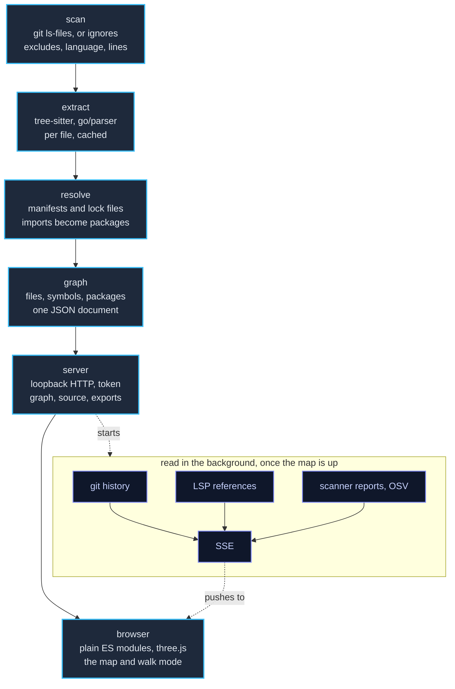

# Contributing to depphunter

This is the developer counterpart to [README.md](README.md): how to build and
test depphunter, how it is structured, and how to work on the VS Code
extension.

## Building and testing

```sh
go test -race ./...
go run honnef.co/go/tools/cmd/staticcheck@2026.2.1 ./...
npm install && npm run lint   # the VS Code extension, whose manifest is at the root
```

Cold-analysis performance (REQ-LANG-029) is measured by a benchmark over a
generated 10 000-file project; it reports the wall time and the CPU time, and
`-cpu` shows how well the work spreads over the cores:

```sh
go test ./internal/analyze -run '^$' -bench ColdAnalysis -benchtime 3x -cpu 1,4
```

The extension has its own edit-and-run cycle, tests and debugging notes, under
[Working on the extension](#working-on-the-extension).

CI (`.github/workflows/ci.yml`) builds and tests on Linux, macOS and Windows,
against the current Go release and against exactly the version `go.mod` states,
with `GOTOOLCHAIN=local`, so that a `go.mod` declaring less than the code
requires fails the build. It also checks formatting, `go mod tidy`, vet,
staticcheck, govulncheck, JavaScript syntax and Markdown, and it type-checks and
packages the VS Code extension. Pushing a `v*` tag runs
`.github/workflows/release.yml`, which runs the tests and then publishes
stripped binaries for every platform listed in
[Install](README.md#install).

Both workflows build the archives with `scripts/dist.sh`, which also works
locally (it needs `zip`):

```sh
scripts/dist.sh v1.2.3                     # every target into dist/
TARGETS="linux/amd64 darwin/arm64" scripts/dist.sh
```

`scripts/record.mjs` records a showcase video of the map and walk mode on this
repository: it builds depphunter into the temporary directory, steps the page's
clock one frame at a time, and encodes the frames and `endcard.html` into an MP4.
What it films is configured rather than coded: `scripts/showcase.json` lists the
scenes in order and each scene's steps (a caption, a click, a catch with the net,
a grapple between two towers), and the script's header describes every step it
knows. It needs Go, ffmpeg with libx264, and Playwright with Chromium in this
repository's `node_modules`; `--no-save` keeps it out of `package.json`, which is
the extension's manifest, so a later `npm ci` removes it again.

```sh
npm install --no-save playwright && npx playwright install chromium
node scripts/record.mjs --plan                    # what each scene will tak
node scripts/record.mjs --preview                 # 640x360 at 10 fps
node scripts/record.mjs --headed --out showcase   # 1280x720 at 30 fps
```

It reports progress as it goes, with the time a frame takes and how long is
left. Without a GPU a walk-mode frame takes seconds and the first frame minutes,
so `--preview` is the practical way to check the scenes; `--headed` renders the
full video much faster on a desktop that has one.

CI builds every target on each push, retains the archives as workflow artifacts
for 14 days, and runs the tests in 32-bit mode (`GOARCH=386`). Renovate
(`renovate.json`) opens grouped pull requests for non-major dependency updates;
an update requiring a newer Go than `go.mod` declares fails the oldest-Go job
until `go.mod` is raised accordingly.

The requirements are specified one per file in
[docs/requirements/](docs/requirements/README.md). Code that implements a
requirement carries an `Implements: REQ-…` comment, and a test that verifies
one a `Verifies: REQ-…` comment; after adding or changing either, regenerate
the traceability matrix:

```sh
node scripts/reqtrace.mjs            # rewrite docs/requirements/TRACEABILITY.md
node scripts/reqtrace.mjs --check    # what CI runs
```

## How it works



1. **Scan** (`internal/scan`) lists the project's files through `git ls-files`
   (so `.gitignore` applies) or a built-in ignore list, applies `exclude`
   globs, and measures language (by extension) and lines of code.
2. **Extract** (`internal/lang/*`): every language plugin claims files and
   extracts imports and top-level symbols from the content alone. Files are
   parsed in parallel; results are cached by the SHA-256 of the content, the
   plugin version and the extension (`internal/cache`), so a second run only
   parses what changed.
3. **Resolve**: a per-run resolver of each plugin reads the manifests and
   lockfiles (`go.mod`, `package.json`, `pyproject.toml`, `Cargo.toml`,
   `pom.xml`, `*.csproj`, …) and turns every import into a local file or
   directory, a standard-library package or an external package with version.
4. **Graph** (`internal/analyze`, `internal/graph`): directories, files,
   symbols, ecosystems and packages become nodes, imports become edges; the
   document is what the UI, the exports and the cache exchange.
5. **Serve** (`internal/server`): a loopback HTTP server with a per-run token
   serves the embedded UI (`web/static`) and the graph (`/api/graph`), file
   source (`/api/file`), exports, "open in editor", "save settings" and the
   session state the map and the editor's side panel share (`/api/session`,
   `/api/selection`, `/api/backpack`).
   The graph carries an `ETag` so a client that already holds it is answered 304,
   and its TypeScript declaration is generated from the Go one
   (`go test ./internal/graph -update`) rather than copied by hand.
   Server-Sent Events (`/api/events`) push new graphs in `--watch` mode
   (`internal/watch`) and announce the git history (`internal/history`), the
   LSP references (`internal/lsp`) and what the scanners reported
   (`internal/findings`), all three read in the background once the map is up
   and re-read whenever a report is written.
6. **Render** (browser, plain ES modules, no build step): `model.js` builds a
   navigable tree with aggregates, `layout.js` computes the archipelago from
   the hierarchy and expansion state (never a force simulation, so the same
   repository always gives the same map), `scene.js` draws every box in one
   instanced three.js mesh and edges as arcs, `routes.js` finds the roads those
   edges take by one sweep over a grid of the map, `pins.js` and `bugs.js` put
   what the scanners reported over the buildings and on the streets,
   `labels.js` places labels, `filter.js` and `history.js` compute filters,
   search and history colors locally, and `walk.js`, `city.js` and `tools.js`
   provide the first-person view and the tools it presents.

The HTML export (`--export html`) inlines the same modules as `data:` URLs with
the graph, settings, history and source text, so the page needs neither
depphunter nor a network.

### Built with

Go libraries (all pure Go, so every target cross-compiles with
`CGO_ENABLED=0`):

| Library                                                             | Used for                                                                |
|---------------------------------------------------------------------|-------------------------------------------------------------------------|
| [odvcencio/gotreesitter](https://github.com/odvcencio/gotreesitter) | tree-sitter runtime and grammars for JS/TS, Python, Rust and Java       |
| [golang.org/x/mod](https://pkg.go.dev/golang.org/x/mod)             | parsing `go.mod`                                                        |
| [BurntSushi/toml](https://github.com/BurntSushi/toml)               | `pyproject.toml`, `Cargo.toml`, Gradle version catalogs, TOML lockfiles |
| [gopkg.in/yaml.v3](https://pkg.go.dev/gopkg.in/yaml.v3)             | config files (comment-preserving save), `pnpm-lock.yaml`                |
| [tidwall/jsonc](https://github.com/tidwall/jsonc)                   | `tsconfig.json` / `jsconfig.json` with comments                         |
| [fsnotify/fsnotify](https://github.com/fsnotify/fsnotify)           | `--watch`                                                               |
| [sourcegraph/jsonrpc2](https://github.com/sourcegraph/jsonrpc2)     | talking to language servers (`--lsp`)                                   |
| [golang.org/x/sync](https://pkg.go.dev/golang.org/x/sync)           | bounded parallel scanning, parsing and LSP requests                     |
| [emicklei/dot](https://github.com/emicklei/dot)                     | DOT export                                                              |
| [kballard/go-shellquote](https://github.com/kballard/go-shellquote) | splitting editor command templates without a shell                      |
| [cli/browser](https://github.com/cli/browser)                       | opening the default browser                                             |
| [spf13/cobra](https://github.com/spf13/cobra)                       | the command line: flags, help, version                                  |
| [spf13/viper](https://github.com/spf13/viper)                       | layering defaults, config files, environment and flags                  |

Go itself provides `go/parser` for Go sources, `net/http` for the server and
`embed` for the UI. The browser UI vendors, in
[web/static/vendor](web/static/vendor/README.md):
[three.js](https://threejs.org) (WebGL rendering, orbit controls),
[highlight.js](https://highlightjs.org) (source highlighting),
[potpack](https://github.com/mapbox/potpack) (packing terraces) and
[fzf-for-js](https://github.com/ajitid/fzf-for-js) (fuzzy search). External
tools are optional: `git` for file listing and history, language servers for
`--lsp`.

### The 3D models

The hands and forearms shown in walk mode are a rigged model, built by
`scripts/hand.py` in Blender and exported to `web/static/hand.glb`. The script is
the source, so the model can be read and regenerated rather than being a binary
that cannot be modified. They are also the only lit objects on the map: the walk
camera carries its own lights and every other material is unlit, which preserves
the city's flat, data-led coloring.

The trees and bushes follow the same arrangement. `scripts/props.py` takes a CC0
low-poly nature pack, separates each model into trunk and crown so that the two
can be colored and tinted independently, decimates it to a cost several thousand
instances can bear, and writes `web/static/props.glb`. The beetle representing a
finding is modelled rather than sourced, since neither pack contains an insect:
`scripts/bug.py` writes `web/static/bug.glb`, with wing cases that take the
severity's color, a dark head and thorax, and six independently animated
legs.

## Working on the extension

The extension's manifest is at the root of the repository rather than in
`extension/`, so that it shares the README and the LICENSE instead of holding
copies: `package.json`, `tsconfig.json` and `.vscodeignore` are at the root, and
`extension/` contains the source and the tests. `.vscodeignore` is written in
the inverse of the usual manner — it excludes everything and then re-includes
the few extension files — because the greater part of this repository is a Go
program.

An extension is a Node program that the editor loads into a separate process,
the *extension host*. It is not a web page, it has no DOM, and its `console.log`
output does not appear where one might expect. Everything below follows from
that.

### The first run

From the root of the repository:

```sh
npm install
npm run compile
```

Open the repository as the workspace, press F5, and select **Run the VS Code
extension** if prompted. A second editor window opens, titled *[Extension
Development Host]*. That window differs from the first only in having the
extension loaded; the first window is now a debugger attached to it.

In the new window, open a folder containing code and run
`depphunter: Open the Map` from the command palette (Ctrl/Cmd+Shift+P).

### Changing code

`npm run watch` in a terminal recompiles on each save. The extension host does
not reload itself, so after saving, switch to the *[Extension Development Host]*
window and run **Developer: Reload Window** (Ctrl/Cmd+R). That is the entire
edit-and-run cycle.

Reloading terminates the extension host, which terminates the `depphunter` it
started, so the next invocation analyses again from a warm cache. No state
persists between runs.

### Breakpoints

Setting a breakpoint in the gutter beside a line of `extension/src/*.ts` in the
**first** window will hit. `tsc` emits source maps, so execution stops in the
TypeScript rather than in `extension/out/`. The Debug Console in that window
receives the extension's `console.log` output and reports uncaught exceptions.

Useful breakpoints when diagnosing a fault: `start()` in `server.ts`, for the
arguments passed to the binary; the `read` function immediately below it, for
what the binary returned; and `show()` in `extension.ts`, for the address handed
to the browser.

### The four places output goes

This is a common source of confusion. There are four separate consoles, and each
shows something different:

| Where                       | What is in it                                                                | How to open it                                                                                |
|-----------------------------|------------------------------------------------------------------------------|-----------------------------------------------------------------------------------------------|
| Debug Console, first window | `console.log` and exceptions from the extension itself                       | F5 opens it                                                                                   |
| Output → **depphunter**     | the server's own log, verbatim: the command line, the analysis, any warnings | *Output: Focus on Output View*, then select depphunter — or `depphunter: Show the Server Log` |
| Output → **Extension Host** | the editor's own diagnostics about loading extensions                        | the same selector                                                                             |
| Webview developer tools     | errors from the map itself: WebGL and the page's JavaScript                  | **Developer: Open Webview Developer Tools** in the *[Extension Development Host]* window      |

If the map opens but is blank or malformed, the last of these is the relevant
one. If the map never opens, the first two are.

### When it goes wrong

- **"depphunter was not found"** — the extension host inherited a `PATH` that
  does not contain it. Set `depphunter.path` to the absolute path, which always
  resolves.
- **The tab opens empty and the webview console reports *Refused to frame*** —
  the server was started without the required `--embed` origin. The
  **depphunter** output channel records the exact command line used; confirm
  that it contains `--embed vscode-webview:`.
- **Nothing happens and no error is reported** — the extension may not have
  activated. **Developer: Show Running Extensions** in the development window
  lists what was loaded and how long each extension took.
- **A change had no effect** — either `npm run watch` was not running or the
  window was not reloaded. The modification time of `extension/out/extension.js`
  distinguishes the two.

### The extension's tests

```sh
go build -o depphunter ./cmd/depphunter
DEPPHUNTER="$PWD/depphunter" npm test   # skipped without a binary to test
```

`npm test` names the test files individually rather than globbing them. This
appears unnecessarily rigid but is not: only Node 22 and later expand a glob
after `--test`, only Node 20 and earlier search a directory given there, and
naming the files is the only form that works with both. A new test file must be
added to the script.

These tests run without an editor: `extension/test/stub.js` substitutes for the
editor API, so that the built `extension/out/extension.js` drives a real server
and the test inspects the result. That is where the coupling lies — the
arguments with which the extension starts `depphunter`, and the address it reads
from that process's output — and neither the Go tests nor the type checker
observes either.

`DEPPHUNTER` must be an absolute path: the extension starts the binary in the
folder it is mapping, and a relative path is not resolved identically on every
platform.

### The binary it ships

A released VSIX carries the `depphunter` built for its platform, at
`bin/depphunter` within the package, so that installing the extension installs
the server it starts and the two cannot be of different versions. `bin/` is not
held in the repository: the workflows place the binary there immediately before
packaging, and a build from a checkout contains none.

The binary to execute is determined in `extension/src/binary.ts`, in this order:

1. `depphunter.path`, whenever it is set. It is the only means of selecting a
   build other than the one the extension shipped with, and is therefore never
   overridden.
2. `bin/depphunter` beside the manifest, where this build has one.
3. `depphunter` on the `PATH`.

Step 2 also sets the executable bit. A VSIX is a zip archive, and a zip's
permission bits do not survive every installer; setting the bit costs nothing
and is preferable to discovering the omission when the server fails to start.

### Installing a local build

```sh
go build -o bin/depphunter ./cmd/depphunter   # optional: what a release would ship
npx @vscode/vsce package --target linux-x64   # or omit --target for a universal one
code --install-extension depphunter-0.1.0.vsix
```

This installs into the ordinary editor, not the development window. `code
--uninstall-extension sarumaj.depphunter` removes it. A `--target` build must
carry a binary for that platform and no other, which is why `bin/` is emptied
between targets in the release workflow.

## Publishing the extension

The extension is not yet published to any marketplace. What publication
requires:

1. `npm install -g @vscode/vsce`, and `vsce package` at the root of the
   repository to build the `.vsix`. The release workflow already does this and
   attaches one per platform to every release, each carrying the matching
   binary and packaged with the tag's version; the `version` in `package.json`
   is only what a build from a checkout gets.
2. For the **Visual Studio Marketplace**: create an Azure DevOps organization,
   then a personal access token with *Marketplace → Manage* scope for **all
   accessible organizations**. Create the publisher at
   <https://marketplace.visualstudio.com/manage>, whose ID has to match the
   `publisher` field in `package.json`. Then `vsce login <publisher>` with that
   token, and `vsce publish` (or `vsce publish minor` to bump the version
   first).
3. For **Open VSX**, which is what VSCodium, Cursor, Gitpod and Eclipse Theia
   install from: an account at <https://open-vsx.org>, an access token, and
   `npx ovsx publish depphunter-0.1.0.vsix -p <token>`.

Because the extension ships a binary, there is one VSIX per `--target`
(`win32-x64`, `win32-arm64`, `linux-x64`, `linux-arm64`, `linux-armhf`,
`darwin-x64`, `darwin-arm64`, `alpine-x64`, `alpine-arm64`) and a universal
build without a binary for every other platform. `vsce publish` accepts them one
at a time, and the marketplace serves each machine the matching build; the
universal build must be published as well, or a platform absent from the list
receives nothing.

The marketplace page is the project's front page: `vsce` takes the `README.md`
beside the manifest and rewrites its relative links to point at GitHub. There is
no second copy to keep synchronized.

The icon is `icon.png` at the root, generated by `scripts/icon.py`, which also
writes the browser's `favicon.svg` and `favicon.png`. Run it after changing the
mark:

```sh
python3 scripts/icon.py
```

These three are the only PNGs excluded from Git LFS (see `.gitattributes`).
Each is a few kilobytes and is read directly from a checkout: `vsce` requires
`icon.png` when packaging, and a clone made without LFS should still present the
correct icon in a browser tab.
