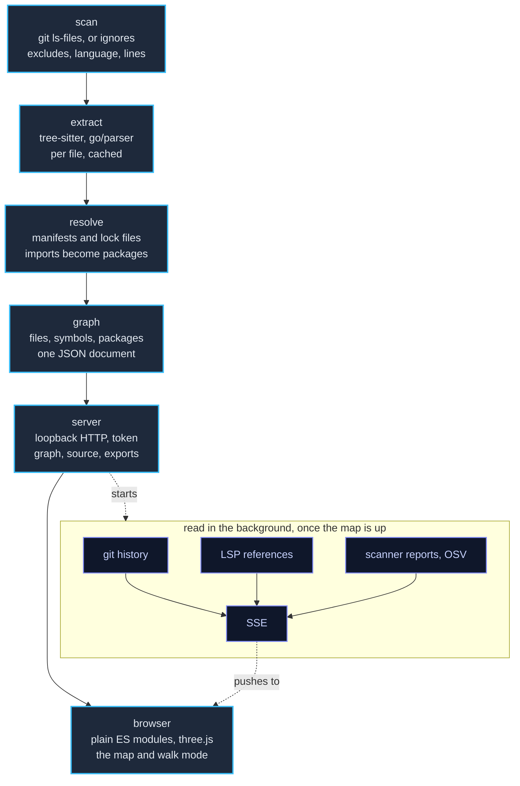

# Contributing to depphunter

This is the developer side of [README.md](README.md): how to build and test
depphunter, how it is put together, and how to work on the VS Code extension.

## Building and testing

```sh
go test -race ./...
go run honnef.co/go/tools/cmd/staticcheck@2026.2.1 ./...
npm install && npm run lint   # the VS Code extension, whose manifest is at the root
```

The extension has its own edit-run loop, tests and debugging notes under
[Working on the extension](#working-on-the-extension).

CI (`.github/workflows/ci.yml`) builds and tests on Linux, macOS and Windows, on
the current Go and on exactly the Go that `go.mod` states, with
`GOTOOLCHAIN=local`, so a `go.mod` that claims less than the code needs fails
the build. It also checks formatting, `go mod
tidy`, vet, staticcheck, govulncheck, JavaScript syntax and Markdown, and
type-checks and packages the VS Code extension. Pushing a
`v*` tag runs `.github/workflows/release.yml`, which tests and then publishes
stripped binaries for every platform in the [Install](README.md#install) table.

Both workflows build the archives with `scripts/dist.sh`, which also works
locally (it needs `zip`):

```sh
scripts/dist.sh v1.2.3                     # every target into dist/
TARGETS="linux/amd64 darwin/arm64" scripts/dist.sh
```

CI builds all targets on every push, keeps the archives for 14 days as workflow
artifacts, and runs the tests as 32-bit (`GOARCH=386`). Renovate
(`renovate.json`) opens grouped pull requests for non-major dependency updates;
one that needs a newer Go than `go.mod` states fails the oldest-Go job until
`go.mod` is raised with it.

The milestones and design decisions are in
[docs/REQUIREMENTS.md](docs/REQUIREMENTS.md).

## How it works



1. **Scan** (`internal/scan`) lists the project's files through `git ls-files`
   (so `.gitignore` applies) or a built-in ignore list, applies `exclude`
   globs, and measures language (by extension) and lines of code.
2. **Extract** (`internal/lang/*`): every language plugin claims files and
   extracts imports and top-level symbols from the content alone. Files are
   parsed in parallel; results are cached by the SHA-256 of the content, the
   plugin version and the extension (`internal/cache`), so a second run only
   parses what changed.
3. **Resolve**: a per-run resolver of each plugin reads the manifests and
   lockfiles (`go.mod`, `package.json`, `pyproject.toml`, `Cargo.toml`,
   `pom.xml`, `*.csproj`, …) and turns every import into a local file or
   directory, a standard-library package or an external package with version.
4. **Graph** (`internal/analyze`, `internal/graph`): directories, files,
   symbols, ecosystems and packages become nodes, imports become edges; the
   document is what the UI, the exports and the cache exchange.
5. **Serve** (`internal/server`): a loopback HTTP server with a per-run token
   serves the embedded UI (`web/static`) and the graph (`/api/graph`), file
   source (`/api/file`), exports, "open in editor" and "save settings".
   Server-Sent Events (`/api/events`) push new graphs in `--watch` mode
   (`internal/watch`) and announce the git history (`internal/history`), the
   LSP references (`internal/lsp`) and what the scanners reported
   (`internal/findings`), all three read in the background once the map is up
   and re-read whenever a report is written.
6. **Render** (browser, plain ES modules, no build step): `model.js` builds a
   navigable tree with aggregates, `layout.js` computes the archipelago from
   the hierarchy and expansion state (never a force simulation, so the same
   repository always gives the same map), `scene.js` draws every box in one
   instanced three.js mesh and edges as arcs, `routes.js` finds the roads those
   edges take by one sweep over a grid of the map, `pins.js` and `bugs.js` put
   what the scanners reported over the buildings and on the streets,
   `labels.js` places labels, `filter.js` and `history.js` compute filters,
   search and history colors locally, and `walk.js`, `city.js` and `tools.js`
   add the first-person view and what it puts in your hands.

The HTML export (`--export html`) inlines the same modules as `data:` URLs with
the graph, settings, history and source text, so the page needs neither
depphunter nor a network.

### Built with

Go libraries (all pure Go, so every target cross-compiles with
`CGO_ENABLED=0`):

| Library                                                             | Used for                                                                |
|---------------------------------------------------------------------|-------------------------------------------------------------------------|
| [odvcencio/gotreesitter](https://github.com/odvcencio/gotreesitter) | tree-sitter runtime and grammars for JS/TS, Python, Rust and Java       |
| [golang.org/x/mod](https://pkg.go.dev/golang.org/x/mod)             | parsing `go.mod`                                                        |
| [BurntSushi/toml](https://github.com/BurntSushi/toml)               | `pyproject.toml`, `Cargo.toml`, Gradle version catalogs, TOML lockfiles |
| [gopkg.in/yaml.v3](https://pkg.go.dev/gopkg.in/yaml.v3)             | config files (comment-preserving save), `pnpm-lock.yaml`                |
| [tidwall/jsonc](https://github.com/tidwall/jsonc)                   | `tsconfig.json` / `jsconfig.json` with comments                         |
| [fsnotify/fsnotify](https://github.com/fsnotify/fsnotify)           | `--watch`                                                               |
| [sourcegraph/jsonrpc2](https://github.com/sourcegraph/jsonrpc2)     | talking to language servers (`--lsp`)                                   |
| [golang.org/x/sync](https://pkg.go.dev/golang.org/x/sync)           | bounded parallel scanning, parsing and LSP requests                     |
| [emicklei/dot](https://github.com/emicklei/dot)                     | DOT export                                                              |
| [kballard/go-shellquote](https://github.com/kballard/go-shellquote) | splitting editor command templates without a shell                      |
| [cli/browser](https://github.com/cli/browser)                       | opening the default browser                                             |
| [spf13/cobra](https://github.com/spf13/cobra)                       | the command line: flags, help, version                                  |
| [spf13/viper](https://github.com/spf13/viper)                       | layering defaults, config files, environment and flags                  |

Go itself provides `go/parser` for Go sources, `net/http` for the server and
`embed` for the UI. The browser UI vendors, in
[web/static/vendor](web/static/vendor/README.md):
[three.js](https://threejs.org) (WebGL rendering, orbit controls),
[highlight.js](https://highlightjs.org) (source highlighting),
[potpack](https://github.com/mapbox/potpack) (packing terraces) and
[fzf-for-js](https://github.com/ajitid/fzf-for-js) (fuzzy search). External
tools are optional: `git` for file listing and history, language servers for
`--lsp`.

### The 3D models

The hands and forearms you see in walk mode are a rigged model, built by
`tools/hand.py` in Blender and exported to `web/static/hand.glb`; the script is
the source for it, so it can be read and regenerated rather than being a binary
nobody can change. They are also the only lit thing on the map - the walk camera
carries its own lights, and every other material is unlit, so the city keeps its
flat, data-first coloring.

The trees and bushes are the same arrangement: `tools/props.py` takes a CC0 low
poly nature pack, splits each model into its trunk and its crown so the map can
color and tint them apart, decimates it to something a few thousand instances
can afford, and writes `web/static/props.glb`. The beetle a finding walks the
streets as is modelled rather than fetched - neither pack has an insect in it -
by `tools/bug.py` into `web/static/bug.glb`: wing cases that take the severity's
color, a dark front end, and six legs that rock on their own.

## Working on the extension

The extension's manifest lives at the root of the repository rather than in
`extension/`, so that it shares the README and the LICENSE instead of keeping
copies: `package.json`, `tsconfig.json` and `.vscodeignore` are up there, and
`extension/` holds the source and the tests. `.vscodeignore` is written the
other way round from usual - it leaves everything out and lets the handful of
extension files back in - because most of what is in this repository is a Go
program.

An extension is a Node program the editor loads into a process of its own, the
*extension host*. It is not a web page, it has no DOM, and `console.log` from it
does not go where you might expect. Everything below follows from that.

### The first run

From the root of the repository:

```sh
npm install
npm run compile
```

Open the repository as the workspace, press F5, and pick **Run the VS Code
extension** if you are asked. A second editor window opens, titled *[Extension
Development Host]*. That window has your extension loaded and nothing else
different about it; the first window is now a debugger attached to it.

In the new window, open a folder with some code in it and run
`depphunter: Open the Map` from the command palette (Ctrl/Cmd+Shift+P).

### Changing code

`npm run watch` in a terminal recompiles on every save. The extension host does
not reload itself, so after a save go to the *[Extension Development Host]*
window and run **Developer: Reload Window** (Ctrl/Cmd+R). That is the whole
edit-run loop.

Reloading kills the extension host, which kills the `depphunter` it started, so
the next open analyzes again from a warm cache. Nothing leaks between runs.

### Breakpoints

Click the gutter beside a line in `extension/src/*.ts` in the **first** window
and it will be hit - `tsc` writes source maps, so you are stopped in the
TypeScript, not in `extension/out/`. The Debug Console there is where
`console.log` from the extension goes, and where an uncaught exception is
reported.

Useful places to stop when something is wrong: `start()` in `server.ts` (what
arguments went to the binary), the `read` function just below it (what came
back), and `show()` in `extension.ts` (what address the browser was handed).

### The four places output goes

This is the part that catches people out. There are four separate consoles and
they show different things:

| Where                       | What is in it                                                                | How to open it                                                                                              |
|-----------------------------|------------------------------------------------------------------------------|-------------------------------------------------------------------------------------------------------------|
| Debug Console, first window | `console.log` and exceptions from *your* extension                           | F5 opens it                                                                                                 |
| Output → **depphunter**     | the server's own log, verbatim: the command line, the analysis, the warnings | *Output: Focus on Output View*, then pick depphunter in the dropdown - or `depphunter: Show the Server Log` |
| Output → **Extension Host** | the editor's own complaints about loading extensions                         | same dropdown                                                                                               |
| Webview developer tools     | errors from the map itself - WebGL, the page's JavaScript                    | **Developer: Open Webview Developer Tools** in the *[Extension Development Host]* window                    |

If the map opens but is blank or broken, it is the last one you want. If the map
never opens, it is the first two.

### When it goes wrong

- **"depphunter was not found"** - the extension host inherited a `PATH` without
  it. Set `depphunter.path` to the absolute path; that always works.
- **The tab opens empty, and the webview console says *Refused to frame*** - the
  server was started without the right `--embed` origin. The **depphunter**
  output channel shows the exact command line it used; check it has
  `--embed vscode-webview:` in it.
- **Nothing happens at all and there is no error** - the extension may not have
  activated. **Developer: Show Running Extensions** in the development window
  lists what loaded and how long each took.
- **A change did nothing** - `npm run watch` was not running, or the window was
  not reloaded. The timestamp on `extension/out/extension.js` settles it.

### The extension's tests

```sh
go build -o depphunter ./cmd/depphunter
DEPPHUNTER="$PWD/depphunter" npm test   # skipped without a binary to test
```

`npm test` names the test files one by one rather than globbing them, which
looks needlessly rigid and is not: only Node 22 and newer expand a glob after
`--test`, only Node 20 and older search a directory given there, and naming the
files is the one form that works on both. Add a file here, add it to the script.

These run without an editor at all: `extension/test/stub.js` stands in for the
editor API, so the built `extension/out/extension.js` drives a real server and
the test checks what came back. That is where the coupling is - the arguments
the extension starts `depphunter` with, and the address it reads out of its
output. Neither the Go tests nor the type checker see either one.

Give `DEPPHUNTER` an absolute path: the extension starts the binary in the
folder it is mapping, and a relative one is not resolved the same way on every
platform.

### The binary it ships

A released VSIX carries the `depphunter` for the platform it was built for, at
`bin/depphunter` inside the package, so installing the extension installs the
server it starts and the two cannot be different versions. `bin/` is not in the
repository: the workflows put the binary there just before packaging, and a
build from a checkout has none.

What gets run is decided in `extension/src/binary.ts`, in this order:

1. `depphunter.path`, when it is set to anything. The only way to point at a
   build that is not the one the extension shipped with, so it is never
   second-guessed.
2. `bin/depphunter` beside the manifest, if this build has one.
3. `depphunter` on the `PATH`.

Step 2 also sets the executable bit. A VSIX is a zip, and a zip's permission
bits do not survive every installer; setting it costs nothing and beats finding
out when the server will not start.

### Installing your build

```sh
go build -o bin/depphunter ./cmd/depphunter   # optional: what a release would ship
npx @vscode/vsce package --target linux-x64   # or omit --target for a universal one
code --install-extension depphunter-0.1.0.vsix
```

That installs it into your real editor, not the development window. `code
--uninstall-extension sarumaj.depphunter` removes it again. A `--target` build
must carry a binary for that platform and nothing else, which is why `bin/` is
emptied between targets in the release workflow.

## Publishing the extension

The extension is not on any marketplace yet. What it takes, when it is time:

1. `npm install -g @vscode/vsce`, and `vsce package` at the root of the
   repository to build the `.vsix`. The release workflow already does this and
   attaches one per platform to every release, each carrying the matching
   binary and packaged with the tag's version; the `version` in `package.json`
   is only what a build from a checkout gets.
2. For the **Visual Studio Marketplace**: create an Azure DevOps organization,
   then a personal access token with *Marketplace → Manage* scope for **all
   accessible organizations**. Create the publisher at
   <https://marketplace.visualstudio.com/manage>, whose ID has to match the
   `publisher` field in `package.json`. Then `vsce login <publisher>` with that
   token, and `vsce publish` (or `vsce publish minor` to bump the version
   first).
3. For **Open VSX**, which is what VSCodium, Cursor, Gitpod and Eclipse Theia
   install from: an account at <https://open-vsx.org>, an access token, and
   `npx ovsx publish depphunter-0.1.0.vsix -p <token>`.

Because the extension ships a binary, there is a VSIX per `--target`
(`win32-x64`, `win32-arm64`, `linux-x64`, `linux-arm64`, `linux-armhf`,
`darwin-x64`, `darwin-arm64`, `alpine-x64`, `alpine-arm64`) and a universal one
without a binary for anything else. `vsce publish` takes them one at a time and
the marketplace hands each machine the one that matches; publish the universal
one too, or a platform off the list gets nothing at all.

The marketplace page is the project's front page: `vsce` takes the `README.md`
beside the manifest and rewrites its relative links to GitHub. There is
no second copy to keep in step.

The icon is `icon.png` at the root, drawn by `tools/icon.py`, which also writes
the browser's `favicon.svg` and `favicon.png`. Run it after changing the mark:

```sh
python3 tools/icon.py
```

Those three are the only PNGs kept out of Git LFS (see `.gitattributes`). They
are a few kilobytes each and are read straight out of a checkout - `vsce` wants
`icon.png` when it packages, and a clone without LFS should still show the right
thing in a browser tab.
