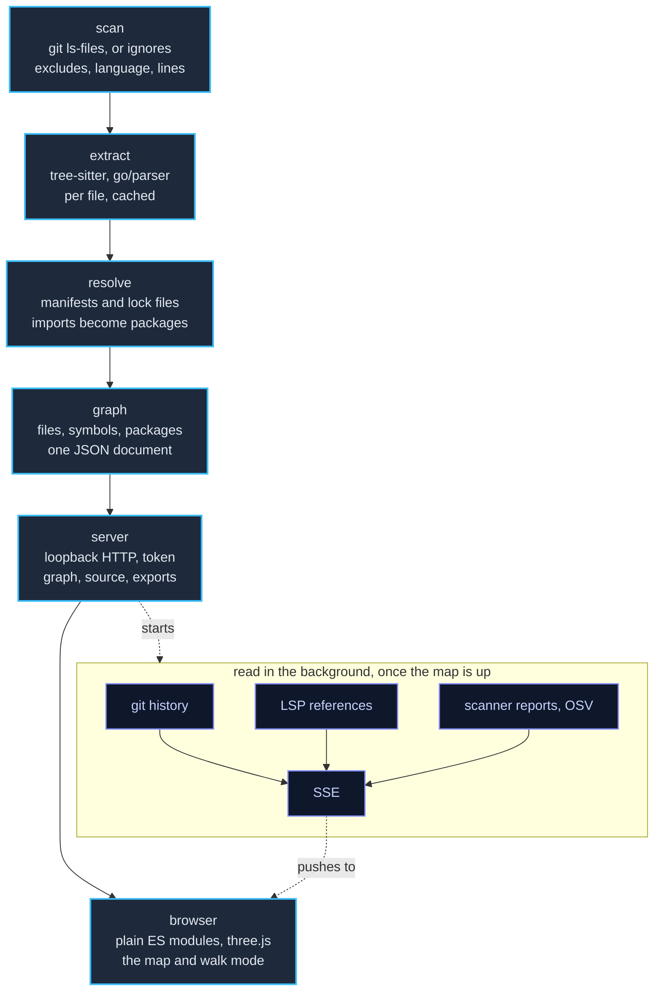
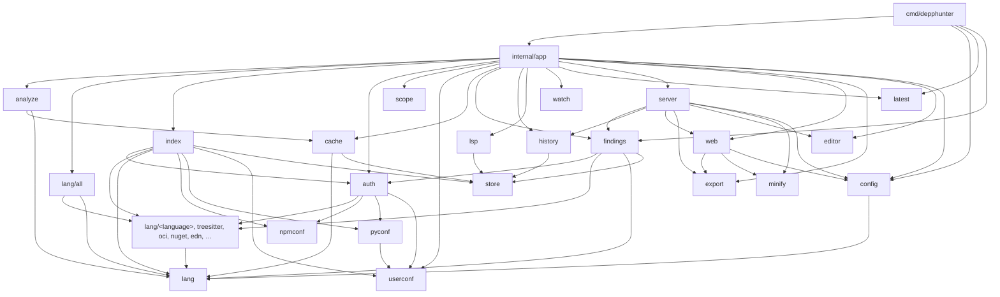

# Contributing to depphunter

This is the developer counterpart to [README.md](README.md): how to build and
test depphunter, how it is structured, and how to work on the VS Code
extension.

## Building and testing

```sh
go test -race ./...
go run honnef.co/go/tools/cmd/staticcheck@2026.2.1 ./...
npm install && npm run lint   # the VS Code extension, whose manifest is at the root
```

Cold-analysis performance (REQ-LANG-029) is measured by a benchmark over a
generated 10 000-file project; it reports the wall time and the CPU time, and
`-cpu` shows how well the work spreads over the cores:

```sh
go test ./internal/analyze -run '^$' -bench ColdAnalysis -benchtime 3x -cpu 1,4
```

The extension has its own edit-and-run cycle, tests and debugging notes, under
[Working on the extension](#working-on-the-extension).

CI (`.github/workflows/ci.yml`) builds and tests on Linux, macOS and Windows,
against the current Go release and against exactly the version `go.mod` states,
with `GOTOOLCHAIN=local`, so that a `go.mod` declaring less than the code
requires fails the build. It also checks formatting, `go mod tidy`, vet,
staticcheck, govulncheck, JavaScript syntax and Markdown, and it type-checks and
packages the VS Code extension. Pushing a `v*` tag runs
`.github/workflows/release.yml`, which runs the tests and then publishes
stripped binaries for every platform listed in
[Install](README.md#install).

Both workflows build the archives with `scripts/dist.sh`, which also works
locally (it needs `zip`):

```sh
scripts/dist.sh v1.2.3                     # every target into dist/
TARGETS="linux/amd64 darwin/arm64" scripts/dist.sh
```

`scripts/record.mjs` records a showcase video of the map and walk mode on this
repository, and `scripts/tour-shots.mjs` takes the pictures the introduction's
cards show (`web/static/tour/*.webp`). Both build depphunter, serve the
repository with made-up scanner reports so the map has bugs and a fire to show,
and drive it in Chromium. `record.mjs` steps the page's clock one frame at a time
and encodes the frames and `endcard.html` into an MP4. What it films is
configured rather than coded: `scripts/record-cfg.json` lists the scenes in order
and each scene's steps (a caption, a click, a catch with the net, grapple hops
from roof to roof), and the script's header describes every step it knows. They
need Go and Playwright with Chromium in this repository's `node_modules`, and
`record.mjs` also ffmpeg with libx264; `--no-save` keeps Playwright out of
`package.json`, which is the extension's manifest, so a later `npm ci` removes it
again.

```sh
npm install --no-save playwright && npx playwright install chromium
node scripts/record.mjs --plan                    # what each scene will take
node scripts/record.mjs --preview                 # 640x360 at 10 fps
node scripts/record.mjs --headed --out showcase   # 1280x720 at 30 fps
node scripts/tour-shots.mjs                       # rewrite web/static/tour/*.webp
```

Both take the same options for what they have in common, and `--help` lists
them all:

| Option        | Default                | Meaning                                                  |
|---------------|------------------------|----------------------------------------------------------|
| `--out DIR`   | per script             | where what it makes goes: `showcase/`, `web/static/tour` |
| `--repo PATH` | this checkout          | the repository to serve                                  |
| `--bin PATH`  | build one              | a depphunter binary to serve it with                     |
| `--port N`    | `0` (any free port)    | the port to serve on                                     |
| `--headed`    | headless (SwiftShader) | draw in a visible browser, which uses the GPU            |
| `--keep-temp` | removed                | leave the temporary directory behind                     |

`CHROMIUM=PATH` uses that browser instead of Playwright's own. What a run makes
and nobody keeps, the binary and the reports, goes in one temporary directory
(`depphunter-record-*` or `depphunter-tourshot-*`), removed when the run ends
however it ends. The 3D models a checkout without Git LFS lacks are fetched
once into the user cache directory (`depphunter/scripts`).

`record.mjs` reports progress as it goes, with the time a frame takes and how
long is left. Without a GPU a walk-mode frame takes seconds and the first frame
minutes, so `--preview` is the practical way to check the scenes; `--headed`
renders the full video much faster on a desktop that has one.

`scripts/shots.mjs` proves that a change to the page which means to change
nothing, such as a helper pulled out or a module split, changes nothing. It
serves a small repository it writes itself, with a git history at fixed dates
and scanner reports, and takes about forty scenes: the side panel for a file, a
package and a finding, the backpack, the photographs, the findings list, the
menus, the dark theme, walk mode with every tool in hand and a shot in flight.
Each is kept as a screenshot and as the page's markup. The page's clock and its
animation frames are frozen and stepped, `Math.random` is seeded and WebGL is
drawn by SwiftShader, so two runs of the same tree agree to the pixel. Take a
baseline before the change and compare after it:

```sh
node scripts/shots.mjs --baseline /tmp/before   # on the tree before the change
node scripts/shots.mjs --compare /tmp/before    # after it: exits 1 if a scene differs
```

`--compare` writes the new scenes beside the baseline, in `/tmp/before.now`,
with a `.diff.png` wherever a scene's pixels moved. Without `--bin` each run
builds this checkout, since the binary embeds the page. `--list` names the
scenes and `--scenes` takes some of them; a walk-mode scene takes a minute or
two. The copy of `app.js` it serves reads the module-scope names `walker`,
`stash`, `state` and `scene`, as `record.mjs` reads `walker`, `bugs`, `fires`,
`stash` and `scene`: a change that renames one of them updates the scripts too.

SwiftShader says little about speed: it runs both sides of every branch and
shades before it tests depth, so a change that saves a GPU work can measure
slower in it. To see what a change of rendering is worth on a real GPU, add
`&stats` to the page's address: a corner of the map then reads out the frame
rate, the CPU time of a frame, the resolution it is drawn at (which drops while
frames fall behind), and the draw calls and triangles.

CI builds every target on each push, retains the archives as workflow artifacts
for 14 days, and runs the tests in 32-bit mode (`GOARCH=386`). Renovate
(`renovate.json`) opens grouped pull requests for non-major dependency updates;
an update requiring a newer Go than `go.mod` declares fails the oldest-Go job
until `go.mod` is raised accordingly.

The requirements are specified one per file in
[docs/requirements/](docs/requirements/README.md). Code that implements a
requirement carries an `Implements: REQ-…` comment, and a test that verifies
one a `Verifies: REQ-…` comment; after adding or changing either, regenerate
the traceability matrix:

```sh
node scripts/reqtrace.mjs            # rewrite docs/requirements/TRACEABILITY.md
node scripts/reqtrace.mjs --check    # what CI runs
```

## How it works


```mermaid
flowchart TB
    SCAN["scan<br/>git ls-files, or ignores<br/>excludes, language, lines"]
    EXTRACT["extract<br/>tree-sitter, go/parser<br/>per file, cached"]
    RESOLVE["resolve<br/>manifests and lock files<br/>imports become packages"]
    GRAPH["graph<br/>files, symbols, packages<br/>one JSON document"]
    SERVER["server<br/>loopback HTTP, token<br/>graph, source, exports"]
    BROWSER["browser<br/>plain ES modules, three.js<br/>the map and walk mode"]

    SCAN --> EXTRACT --> RESOLVE --> GRAPH --> SERVER --> BROWSER

    subgraph BG["read in the background, once the map is up"]
        direction LR
        HISTORY["git history"]
        LSP["LSP references"]
        FINDINGS["scanner reports, OSV"]
        SSE["SSE"]

        HISTORY --> SSE
        LSP --> SSE
        FINDINGS --> SSE
    end

    SERVER -.->|"starts"| BG
    SSE -.->|"pushes to"| BROWSER

    classDef stage fill:#1e293b,stroke:#38bdf8,stroke-width:2px,color:#e2e8f0
    classDef bg    fill:#0f172a,stroke:#818cf8,stroke-width:1.5px,color:#c7d2fe

    class SCAN,EXTRACT,RESOLVE,GRAPH,SERVER,BROWSER stage
    class HISTORY,LSP,FINDINGS,SSE bg
```

1. **Scan** (`internal/scan`) lists the project's files through `git ls-files`
   (so `.gitignore` applies) or a built-in ignore list, applies `exclude`
   globs, and measures language (by extension) and lines of code.
2. **Extract** (`internal/lang/*`): every language plugin claims files and
   extracts imports and top-level symbols from the content alone. Files are
   parsed in parallel; results are cached by the SHA-256 of the content, the
   plugin version and the extension (`internal/cache`), so a second run only
   parses what changed.
3. **Resolve**: a per-run resolver of each plugin reads the manifests and
   lockfiles (`go.mod`, `package.json`, `pyproject.toml`, `Cargo.toml`,
   `pom.xml`, `*.csproj`, …) and turns every import into a local file or
   directory, a standard-library package or an external package with version.
4. **Graph** (`internal/analyze`, `internal/graph`): directories, files,
   symbols, ecosystems and packages become nodes, imports become edges; the
   document is what the UI, the exports and the cache exchange.
5. **Serve** (`internal/server`): a loopback HTTP server with a per-run token
   serves the embedded UI (`web/static`) and the graph (`/api/graph`), file
   source (`/api/file`), exports, "open in editor", "save settings" and the
   session state the map and the editor's side panel share (`/api/session`,
   `/api/selection`, `/api/backpack`).
   The graph carries an `ETag` so a client that already holds it is answered 304,
   and its TypeScript declaration is generated from the Go one
   (`go test ./internal/graph -update`) rather than copied by hand.
   Server-Sent Events (`/api/events`) push new graphs in `--watch` mode
   (`internal/watch`) and announce the git history (`internal/history`), the
   LSP references (`internal/lsp`) and what the scanners reported
   (`internal/findings`), all three read in the background once the map is up
   and re-read whenever a report is written.
6. **Render** (browser, plain ES modules, no build step): `model.js` builds a
   navigable tree with aggregates, `layout.js` computes the archipelago from
   the hierarchy and expansion state (never a force simulation, so the same
   repository always gives the same map), `scene.js` draws every box in one
   instanced three.js mesh and edges as arcs, `city.js` paints the streets
   into the free space of every terrace from a grid listing the footprints
   near each cell, `pins.js` and `bugs.js` put what the scanners reported over
   the buildings and on the streets, `labels.js` places labels, `filter.js`
   and `history.js` compute filters, search and history colors locally, and
   `walk.js`, `city.js` and `tools.js` provide the first-person view and the
   tools it presents.

The HTML export (`--export html`) inlines the same modules as `data:` URLs with
the graph, settings, history and source text, so the page needs neither
depphunter nor a network.

### Built with

Go libraries (all pure Go, so every target cross-compiles with
`CGO_ENABLED=0`):

| Library                                                             | Used for                                                                                                                                                                                                                                                                                                                                                              |
|---------------------------------------------------------------------|-----------------------------------------------------------------------------------------------------------------------------------------------------------------------------------------------------------------------------------------------------------------------------------------------------------------------------------------------------------------------|
| [odvcencio/gotreesitter](https://github.com/odvcencio/gotreesitter) | tree-sitter runtime and grammars for JS/TS, Python, Rust, Java, Kotlin, Scala, PHP, Ruby                                                                                                                                                                                                                                                                              |
| [BurntSushi/toml](https://github.com/BurntSushi/toml)               | `pyproject.toml`, `Cargo.toml`, Gradle version catalogs, TOML lockfiles, Julia's Pkg files, Gleam's `gleam.toml` and `manifest.toml`, fpm's `fpm.toml` and `build/cache.toml`, Alire's `alire.toml` and `alire.lock`, Foundry's `foundry.toml` and `soldeer.lock`                                                                                                     |
| [gopkg.in/yaml.v3](https://pkg.go.dev/gopkg.in/yaml.v3)             | config files (comment-preserving save), `pnpm-lock.yaml`, `pubspec.yaml`, `pubspec.lock`, `package.yaml`, `stack.yaml`, `stack.yaml.lock`, Buf's `buf.yaml`, `buf.lock` and templates, `Podfile.lock`, CPAN's `META.yml`, spago's `spago.yaml` and `spago.lock`, shards' `shard.yml`, `shard.lock` and `shard.override.yml`, puppetlabs_spec_helper's `.fixtures.yml` |
| [tidwall/jsonc](https://github.com/tidwall/jsonc)                   | `tsconfig.json` / `jsconfig.json` with comments, Bun's `bun.lock`                                                                                                                                                                                                                                                                                                     |
| [fsnotify/fsnotify](https://github.com/fsnotify/fsnotify)           | `--watch`                                                                                                                                                                                                                                                                                                                                                             |
| [sourcegraph/jsonrpc2](https://github.com/sourcegraph/jsonrpc2)     | talking to language servers (`--lsp`)                                                                                                                                                                                                                                                                                                                                 |
| [golang.org/x/sync](https://pkg.go.dev/golang.org/x/sync)           | bounded parallel scanning, parsing and LSP requests                                                                                                                                                                                                                                                                                                                   |
| [emicklei/dot](https://github.com/emicklei/dot)                     | DOT export                                                                                                                                                                                                                                                                                                                                                            |
| [kballard/go-shellquote](https://github.com/kballard/go-shellquote) | splitting editor command templates without a shell                                                                                                                                                                                                                                                                                                                    |
| [cli/browser](https://github.com/cli/browser)                       | opening the default browser                                                                                                                                                                                                                                                                                                                                           |
| [spf13/cobra](https://github.com/spf13/cobra)                       | the command line: flags, help, version                                                                                                                                                                                                                                                                                                                                |
| [spf13/viper](https://github.com/spf13/viper)                       | layering defaults, config files, environment and flags                                                                                                                                                                                                                                                                                                                |

Go itself provides `go/parser` for Go sources, `net/http` for the server and
`embed` for the UI. The browser UI vendors, in
[web/static/vendor](web/static/vendor/README.md):
[three.js](https://threejs.org) (WebGL rendering, orbit controls),
[highlight.js](https://highlightjs.org) (source highlighting) and
[fzf-for-js](https://github.com/ajitid/fzf-for-js) (fuzzy search). External
tools are optional: `git` for file listing and history, language servers for
`--lsp`.

### The 3D models

The hands and forearms shown in walk mode are a rigged model, built by
`scripts/hand.py` in Blender and exported to `web/static/hand.glb`. The script is
the source, so the model can be read and regenerated rather than being a binary
that cannot be modified. They are also the only lit objects on the map: the walk
camera carries its own lights and every other material is unlit, which preserves
the city's flat, data-led coloring.

The trees and bushes follow the same arrangement. `scripts/props.py` takes a CC0
low-poly nature pack, separates each model into trunk and crown so that the two
can be colored and tinted independently, decimates it to a cost several thousand
instances can bear, and writes `web/static/props.glb`. The beetle representing a
finding is modeled rather than sourced, since neither pack contains an insect:
`scripts/bug.py` writes `web/static/bug.glb`, with wing cases that take the
severity's color, a dark head and thorax, and six independently animated
legs.

The walker's own legs are modeled too: `scripts/legs.py` writes
`web/static/legs.glb`, one rig and three meshes skinned to it, one for each
style's outfit, colored with vertex colors and marked with the fabric each
vertex is (`_CLOTH`). The hands are not remodeled for the outfits; their
sleeves and gloves are layers cut from the arm's own mesh at load time
(`web/static/walk/cloth.js`), which also shades every fabric with its weave.

What the parks' play equipment is made of is mostly posts, bars and blocks, which
are what a goal frame or a swing's legs are, and are built in
`web/static/map/amenities.js`. The few parts that read poorly that way are
modeled by `scripts/play.py` into `web/static/play.glb` - a swing's belt seat, a
spring rider's horse, the basketball and goal nets - and painted by the same
code as the rest.

## Architecture

[How it works](#how-it-works) follows one run through its stages. This section
maps the same program by Go package: what each one owns, which way the imports
point, the contract a language plugin signs, and the rules that decide what
depphunter may read and which servers it may talk to.

### Package map

Arrows point from importer to imported, as `go list` reports the imports of
`./...`. `graph`, `trace` and `scan` are imported almost everywhere and are
left out, and the 52 plugins and the readers they share are one box.


```mermaid
flowchart TB
    main["cmd/depphunter"] --> app & config & latest & findings
    app["internal/app"] --> analyze & all & index & auth & scope & userconf
    app --> cache & findings & history & lsp & watch & latest
    app --> server & web & export & editor & config
    all["lang/all"] --> plugins & lang
    plugins["lang/&lt;language&gt;, treesitter, oci, nuget, edn, …"] --> lang
    analyze --> cache & lang
    cache --> lang & store
    config --> lang
    index --> auth & plugins & lang & npmconf & pyconf & userconf & store
    auth --> plugins & npmconf & pyconf & userconf
    pyconf --> userconf
    findings --> auth & plugins & lang & store
    history --> store
    lsp --> store
    server --> findings & history & web & export & editor & minify & config
    web --> export & minify & config
```

`analyze` never imports `index`, and `index` never imports `scope`. The walk
declares what it needs as small interfaces in `internal/analyze/analyze.go`
(`Indexes`, `TargetIndexes`, `Locator`, `Discovered`, `Traced`); `index.Config`
and `index.Client` satisfy them, and `internal/app` connects the two. The
private scope reaches `index` as a function, `Config.Private`. Keep those
directions when the walk has a new question to ask.

### Packages

| Package | Responsibility | Key types and entry points |
|---|---|---|
| `cmd/depphunter` | A thin shell: the cobra command, flags through `config`, the log's output, then `app.Run`. | `newCommand`, `logOutput` |
| `app` | One run: the cache, plugins, credentials, private scope and index client wired into one analysis (`app.go`), then the export (`export.go`) or the served map (`serve.go`) with its background loaders (`loaders.go`) and `--watch`. | `Run` |
| `latest` | Runs a function on the newest value handed to it, one call at a time; a burst of re-analyses becomes one follow-up run of each loader. | `Runner[T]`, `New` |
| `config` | Settings from defaults, user and project files, `DEPPHUNTER_*` and flags (viper); saving the view settings; what a project file may set. | `Config`, `UI`, `RegisterFlags`, `Load`, `SaveUI` |
| `scan` | Lists files (`git ls-files`, or a walk with built-in ignores), maps names to languages (`lang.go`), reads `#!` lines, counts lines, flags binary and oversized files. | `File`, `Options`, `Scan`, `Language` |
| `lang` | The plugin contract (`lang.go`) and the helpers every plugin shares; see below. | `Plugin`, `Resolver`, `Target`, `Extraction`, `Analyze` |
| `lang/all` | The one list of plugins, in the order they run; the command and the benchmark both take it. | `Plugins`, `Options` |
| `lang/<language>` | One plugin per ecosystem family (`golang`, `javascript`, `python`, …); shared readers beside them (`treesitter`, `oci`, `nuget`, `edn`, `starlark`, `cocoapods`, `juliapkg`, `luarocks`, `opam`, `yamlnode`), the lexers' byte tests in `chars`, test helpers in `langtest`. | `Plugin{}` |
| `cache` | Plugin extractions keyed by plugin, version, class and content hash; one gob file per project. A nil cache caches nothing. | `Cache`, `Open`, `Key` |
| `analyze` | Turns files and plugin results into the graph, then walks dependencies of dependencies level by level. | `Run`, `Options`, `Stats` |
| `graph` | The document shared by analysis, UI, exports and the extension; node IDs are built and parsed here only. | `Graph`, `Node`, `Edge`, `*ID`, `EcosystemOf`, `FileOf`, `(*Graph).Of` |
| `trace` | The resolution report: every question the walk asked and who answered it, as text, Markdown or JSON. A nil report records nothing. | `Report`, `Lookup`, `Note` |
| `userconf` | Where each package manager keeps its configuration on this machine, as the tool itself finds it. | `Machine`, `Platform`, `SystemRoot` |
| `npmconf`, `pyconf` | Parse Yarn/Bun and uv/Poetry/Pipenv/PDM settings as written; they make no trust decisions. | parsers |
| `auth` | Credentials this machine holds, each filed under its host, and the one rule for where one may be sent. | `Store`, `ReadFor`, `Apply`, `MaySend` |
| `scope` | Which packages are the organization's own (`--private`, `GOPRIVATE`, `GONOPROXY`). | `Private`, `New`, `FromGoEnvironment` |
| `index` | Where each package comes from, and, with `--online`, asking trusted indexes what a package depends on. | `Discoverer`, `Config`, `Client` |
| `store` | Expiring answers from other people's servers, results computed for one project, and the atomic writer every on-disk cache uses. A nil store keeps nothing. | `Store`, `Get[T]`, `Result[T]`, `WriteAtomic` |
| `findings` | Scanner reports, OSV and link checks, placed on files and packages; which documents and pinned packages to check (`graph.go`) and which report files to watch (`load.go`). | `Set`, `Finding`, `Collect`, `Documents`, `Pinned`, `Watched` |
| `history`, `lsp` | Git history per file, and symbol references from installed language servers; both kept per project in a `store.Result`. | `History`, `Result`, `Cached`, `lsp.Servers` |
| `watch` | fsnotify on analyzed directories, debounced. | `Watcher` |
| `server` | Loopback HTTP API, token and cookie, SSE, the session shared with the editor panel; `response.go` keeps each body encoded once, with its ETag and gzip, and answers 304. | `Server`, `New`, `Handler` |
| `export`, `web`, `minify`, `editor` | JSON, GraphML and DOT; the embedded UI and the self-contained HTML export; stripping comments from UI assets; editor command templates. | `export.Write`, `web.WriteStatic`, `editor.Command` |

### The language plugin contract

A plugin implements `lang.Plugin` ([internal/lang/lang.go]); the split between
reading a file and resolving what it names is what makes caching possible
([REQ-LANG-025]):

- `Name()` and `Version()`: bump `Version` whenever `Extract` returns
  something different for the same input, or stale cache entries are reused
  ([REQ-LANG-026]).
- `Claims(*scan.File)`: which files are the plugin's ([REQ-LANG-001]).
- `Ecosystems()`: the islands its packages land on, with `Std` for a
  standard library. An ecosystem several plugins share is spelled with a
  constant from `ecosystems.go` (`lang.EcosystemNPM`, …).
- `Extract(file, source)`: imports and symbols from the content alone. It is
  cached by content, so it must not read other files.
- `Resolver(root, files)`: built once per run from manifests and lock files;
  `Resolve(file, RawImport)` returns a `Target` ([REQ-LANG-004]).

Optional interfaces, discovered by type assertion: `Classifier` (extraction
also depends on the path; `Class` joins the cache key), `Expander` (one
import becomes several), `Transitive` (what a package depends on, from lock
files), `Installed` (that answer came from an environment) and `Noter`
(embed `lang.NoteList` to tell `--explain` what no single question shows).

The helpers keep plugins from growing their own copies: `util.go`
(`ForEachFile`, `SymbolSet`, `MaxParseSize`), `paths.go` (walking up
directories, `Layout` and `PathSet` of the files a resolver was given,
`ClimbsOut`), `text.go`, `memo.go` (`Memo`, a typed `sync.Map`),
`version.go` and `gitpin.go` (pinning rules); a hand-written lexer takes its
byte tests from `lang/chars` (`IsWord`, `IsIdentStart`, `IsDigit`, `At`,
`LineEnd`, …). `read.go` holds how a resolver
reads ([REQ-LANG-031]): a file under the repository through `lang.Root`
(`lang.OpenRoot`), which refuses a path that leaves the repository through
`..` or a symbolic link with `ErrOutside`; this machine's configuration and
installed trees through `lang.Machine`; and the scanned copy of a listed file
before the disk through `Source`.

Plugins are registered in one place, `all.Plugins` ([internal/lang/all]).
`internal/app` and the cold-analysis benchmark both run that list. Its order
is part of the output: plugins run one after another in it, so it decides
the order of the graph's nodes and edges.

Adding a language:

1. Map its extensions and file names in `internal/scan/lang.go`
   (`byExtension`, `byName`), with a case in `lang_test.go`.
2. Create `internal/lang/<name>` with `Plugin`, `Extract` and a resolver.
   Prefer a tolerant scanner, or `lang/treesitter` when a grammar is
   vendored, and read through `lang.Root` and the `lang` helpers.
3. Add a fixture project under `internal/lang/<name>/testdata/repo/` and
   tests that call `langtest.Analyze`, `langtest.CheckImports` and
   `langtest.CheckSymbols` (`testdata` is never annotated).
4. Add the plugin to `all.Plugins`, where its place in the order matters.
5. If a language server answers references, add it to `lsp.Servers`.
6. For a new ecosystem, add it to the private-pattern prefixes (`ecosystems`
   in `internal/scope/scope.go`) and, where OSV or Trivy know it, to
   `osvEcosystems` and `trivyEcosystems` in `internal/findings`.
7. If `--online` should reach its index, teach `internal/index` the
   ecosystem: configuration locations in `userconf`, credentials in `auth`.
8. Write its requirements in `docs/requirements/<scope>/`, add the scope to
   the table in [that README][requirements], annotate the code and tests,
   and regenerate the matrix.
9. Describe it in `README.md` beside the other languages, and add any new
   words to `.vscode/settings.json`.

### Where packages come from: index, auth and userconf

Three packages split one question. `userconf` knows *where* each tool's
files are ([REQ-SUP-064]); `npmconf` and `pyconf` read *what* they say.
`index` decides *which* index serves a package, and `auth` decides *which*
credential may go with a request ([REQ-AUTH-020]). The repository is read,
but never trusted with anything that decides what is sent where:

- A project configuration file sets only what `projectKeys` in
  `internal/config/config.go` allows; `userOnlyKeys` says why each other
  setting (`online`, `trust_indexes`, `editor`, `python`) is left to the user
  ([REQ-CFG-018]).
- An index only the repository names is recorded and marked unknown
  ([REQ-SUP-018]), and is never fetched from ([REQ-SUP-019]). Where both the
  machine and the repository name an index, the machine's wins
  ([REQ-SUP-016]). `--trust-index` vouches for such an index
  ([REQ-SUP-042]), and only the user can give it ([REQ-SUP-043]).
- Nothing is asked without `--online` ([REQ-SUP-020]), and lock files are
  asked before indexes ([REQ-SUP-030]).
- The private scope ([REQ-SUP-034]) is given to `index` once, through
  `Config.Private`, and every choice of an index for a package goes through
  `Config.owned` and `Config.nameable`: a private package is never named to a
  public index ([REQ-SUP-038]) but is asked of a private index this machine
  configures ([REQ-SUP-039]). `findings.Pinned` leaves it out of what is sent
  to OSV ([REQ-SUP-040]).
- Credentials come from this machine only, and go only to their host
  ([REQ-AUTH-011], [REQ-SUP-033]). A credential in an index URL the
  repository names is discarded ([REQ-AUTH-012]). `auth.MaySend` is the one
  definition of where a credential may go whatever the configuration says
  (https, or http to loopback); `Apply` and every credential sent outside it
  (a Buf token, a Conan login) check it.
- A resolver reads the repository through `lang.Root`, so neither `..` nor a
  committed symbolic link reaches the rest of the machine ([REQ-LANG-031]).

### The path of an `--online` lookup

1. `app.Run` calls `wireIndexes`, which reads `auth.ReadFor`, builds
   `scope.New` from `--private` and the Go environment, and gives an
   `index.Discoverer`'s `Config` the credentials, trusted URLs and private
   scope. `index.NewClient` keeps its answers for a day under
   `<cache>/index` ([REQ-SUP-032]).
2. `analyze.Run` calls `Discoverer.Discover` with the scanned files, so the
   repository's `.npmrc` and similar files are read as claims. Every package
   node is attributed with `Config.ForTarget`.
3. `builder.expand` asks one level at a time, 12 at once, through `chain`:
   the plugin's `Transitive` (lock files) first, then `Client.Dependencies`
   ([REQ-SUP-030]).
4. `Client.Dependencies` stops for installed packages, keeps only the
   indexes `Config.nameable` allows, sets aside untrusted indexes, and checks
   Hex keys. It then answers from this run's memo, from `store`, or with a
   request whose credential `auth` picks by host. Requests go through
   `getJSON[T]` or `acceptJSON[T]` and `readOK`; per-index listings are read
   once through `lazy[T]`.
5. Every exit records a `trace.Lookup` with its answer and reason
   ([REQ-TRC-005], [REQ-TRC-006]). `Located` lets `analyze` move a package
   to the index that actually had it ([REQ-SUP-063]).
6. The report ([REQ-TRC-001]) goes to the log with `--explain`, and to
   `/api/resolution` as JSON, `md` or `text`.

### The web UI and the extension

`web/embed.go` embeds `web/static`, and `web/static.go` inlines it for
`--export html`. Headless tests of the modules are in `web/uitest`, and
`scripts/shots.mjs` compares the whole page
([Building and testing](#building-and-testing)).

Every directory under `web/static` is one part of the page; a module's file
name is unique across all of them, because the export's import map knows modules
by file name alone.

| Directory | Modules | Owns |
|---|---|---|
| `web/static` | `index.html`, `app.js`, `style.css` | The page, application state, menus and wiring every module together; beside them the `.glb` models, the introduction's pictures (`tour/`) and the third-party libraries (`vendor/`) |
| `core/` | `data.js`, `dom.js`, `numbers.js`, `model.js`, `filter.js`, `history.js`, `findings.js`, `colors.js` | Talking to the server, or reading the data a static export embeds; DOM helpers and what several modules show alike (the toolbar popover `drawer`, a finding's row `findingItem`, the catch button `catchToggle`); `clamp` and `ease`; the navigable tree and aggregates, filters and search, history metrics, findings by node, color roles from CSS |
| `map/` | `layout.js`, `labels.js`, `scene.js`, `city.js`, `cityglsl.js`, `buildings.js`, `details.js`, `lod.js`, `resolution.js`, `stats.js`, `models.js` | The archipelago layout and its labels, three.js rendering, the procedural city and its shaders, building types and facades, balconies and rooftop details, culling and level of detail for the props, dynamic resolution, the `?stats` readout, loading the `.glb` models |
| `hunt/` | `pins.js`, `bugs.js`, `fires.js`, `flames.js` | Findings over the map, bugs on buildings, reachable vulnerabilities as fire |
| `panels/` | `panel.js`, `source.js`, `findinglist.js`, `backpack.js`, `stash.js`, `tour.js` | The side panel and the source it shows, the list of findings, the catch, photographs, the introduction |
| `walk/` | `walk.js`, `walkbase.js`, `tracker.js`, `shots.js`, `canopy.js`, `tools.js`, `switcher.js`, `hands.js`, `avatar.js`, `parachute.js`, `health.js`, `wind.js` | Walk mode: the walker and the measures its parts share, the tracker and beacons that show where the hunt is, what it throws and the lines it pays out, its tools and hands, its marker on the map, the parachute and the walker under it, health and stamina |

In the extension (`extension/src`), `extension.ts` runs one server per
folder and registers the commands from one table, `COMMANDS`. `server.ts`
starts the binary chosen by `binary.ts` and reads its address. `api.ts` talks
to that server, and `panel.ts` shows the map in a tab. The activity-bar
views, `view.ts`, `tree.ts`, `findings.ts` and `backpack.ts`, extend one base,
`ListView` in `list.ts`. `graph.ts` is generated from `internal/graph`
(`go test ./internal/graph -update`). `launcher.ts` finds the editor's
command-line launcher, and `terminal.ts` puts depphunter on the `PATH` of the
editor's terminals.

### Requirements traceability

Each requirement is one file,
`docs/requirements/<scope>/REQ-<SCOPE>-<NNN>-<slug>.md`, with front matter as
in [TEMPLATE.md][template]. Identifiers are never reused. `Implements: REQ-…`
goes in the comment directly above the declaration that implements it, in a
tracked source file outside `vendor/`, `node_modules/`, `testdata/` and
`docs/`. `Verifies: REQ-…` is allowed only in tests (`_test.go`,
`*.test.mjs`, `web/uitest/`, `extension/test/`, and CI workflows).
`scripts/reqtrace.mjs` links each annotation to its declaration's name rather
than its line. `--check` fails on an unknown identifier, `Verifies` outside a
test, an `implemented` or `partial` requirement with no `Implements`, a
leftover `uuid:` field, or a stale `TRACEABILITY.md`.

### Conventions

- American English in code, comments and documents (behavior, color,
  canceled, modeled), except in names others define (Erlang's `behaviour`,
  `Data.Colour`).
- Full identifier names: `source`, `directory`, `dependencies`,
  `packageName`, `ecosystem`, `index`, `reference`. No `src`, `dir`,
  `deps`, `pkg`, `eco`, `idx` or `ref`.
- Requirements carry no `uuid:`; the `REQ-…` identifier is the only key.
- Tests that read machine configuration through `auth`, `index` or
  `findings` pin `userconf.Platform = "linux"` and point
  `userconf.SystemRoot` at an empty directory in `TestMain`. Other
  platforms are tested with an explicit `GOOS`.
- A resolver reads a file the scan did not list, or any path the repository
  names, through `lang.Root` or `lang.Source`; a listed file by its
  `AbsolutePath` or `lang.ReadScanned`, since the scan lists no symbolic
  link.
- "Off" is a nil receiver (`*trace.Report`, `*cache.Cache`, `*store.Store`,
  `*index.Client`), not a flag checked by every caller.
- A refactoring that means to change nothing proves it: the same `--export`
  output over every `testdata` project before and after (apart from
  `generatedAt`), and, for the page, `scripts/shots.mjs --compare` against a
  baseline. The scripts that compare exports are scratch tools, not part of
  the repository.

[internal/lang/lang.go]: internal/lang/lang.go
[internal/lang/all]: internal/lang/all/all.go
[requirements]: docs/requirements/README.md
[template]: docs/requirements/TEMPLATE.md
[REQ-AUTH-011]: docs/requirements/auth/REQ-AUTH-011-credential-bound-to-host.md
[REQ-AUTH-012]: docs/requirements/auth/REQ-AUTH-012-url-credential-from-machine-only.md
[REQ-AUTH-020]: docs/requirements/auth/REQ-AUTH-020-credential-file-locations.md
[REQ-CFG-018]: docs/requirements/cfg/REQ-CFG-018-project-config-allow-list.md
[REQ-LANG-001]: docs/requirements/lang/REQ-LANG-001-plugins-claim-files.md
[REQ-LANG-004]: docs/requirements/lang/REQ-LANG-004-import-resolution-targets.md
[REQ-LANG-025]: docs/requirements/lang/REQ-LANG-025-extract-and-resolve-split.md
[REQ-LANG-026]: docs/requirements/lang/REQ-LANG-026-content-addressed-extraction-cache.md
[REQ-LANG-031]: docs/requirements/lang/REQ-LANG-031-reads-stay-inside-the-repository.md
[REQ-SUP-016]: docs/requirements/sup/REQ-SUP-016-machine-configuration-preferred.md
[REQ-SUP-018]: docs/requirements/sup/REQ-SUP-018-repository-only-index-marked.md
[REQ-SUP-019]: docs/requirements/sup/REQ-SUP-019-repository-only-index-never-fetched.md
[REQ-SUP-020]: docs/requirements/sup/REQ-SUP-020-online-allows-asking-trusted-indexes.md
[REQ-SUP-030]: docs/requirements/sup/REQ-SUP-030-lock-files-asked-before-indexes.md
[REQ-SUP-032]: docs/requirements/sup/REQ-SUP-032-index-answers-cached-one-day.md
[REQ-SUP-033]: docs/requirements/sup/REQ-SUP-033-index-requests-carry-host-credentials.md
[REQ-SUP-034]: docs/requirements/sup/REQ-SUP-034-private-package-patterns.md
[REQ-SUP-038]: docs/requirements/sup/REQ-SUP-038-private-package-hidden-from-public-index.md
[REQ-SUP-039]: docs/requirements/sup/REQ-SUP-039-private-package-asked-of-machine-index.md
[REQ-SUP-040]: docs/requirements/sup/REQ-SUP-040-private-package-not-sent-to-osv.md
[REQ-SUP-042]: docs/requirements/sup/REQ-SUP-042-trust-index-vouches-for-repository-index.md
[REQ-SUP-043]: docs/requirements/sup/REQ-SUP-043-trust-index-only-from-user-and-cli.md
[REQ-SUP-063]: docs/requirements/sup/REQ-SUP-063-additive-sources-fall-back-to-the-public-index.md
[REQ-SUP-064]: docs/requirements/sup/REQ-SUP-064-tool-configuration-locations.md
[REQ-TRC-001]: docs/requirements/trc/REQ-TRC-001-one-report-per-analysis.md
[REQ-TRC-005]: docs/requirements/trc/REQ-TRC-005-per-question-answer-source.md
[REQ-TRC-006]: docs/requirements/trc/REQ-TRC-006-distinct-unanswered-reasons.md

## Working on the extension

The extension's manifest is at the root of the repository rather than in
`extension/`, so that it shares the README and the LICENSE instead of holding
copies: `package.json`, `tsconfig.json` and `.vscodeignore` are at the root, and
`extension/` contains the source and the tests. `.vscodeignore` is written in
the inverse of the usual manner — it excludes everything and then re-includes
the few extension files — because the greater part of this repository is a Go
program.

An extension is a Node program that the editor loads into a separate process,
the *extension host*. It is not a web page, it has no DOM, and its `console.log`
output does not appear where one might expect. Everything below follows from
that.

### The first run

From the root of the repository:

```sh
npm install
npm run compile
```

Open the repository as the workspace, press F5, and select **Run the VS Code
extension** if prompted. A second editor window opens, titled *[Extension
Development Host]*. That window differs from the first only in having the
extension loaded; the first window is now a debugger attached to it.

In the new window, open a folder containing code and run
`depphunter: Open the Map` from the command palette (Ctrl/Cmd+Shift+P).

### Changing code

`npm run watch` in a terminal recompiles on each save. The extension host does
not reload itself, so after saving, switch to the *[Extension Development Host]*
window and run **Developer: Reload Window** (Ctrl/Cmd+R). That is the entire
edit-and-run cycle.

Reloading terminates the extension host, which terminates the `depphunter` it
started, so the next invocation analyzes again from a warm cache. No state
persists between runs.

### Breakpoints

Setting a breakpoint in the gutter beside a line of `extension/src/*.ts` in the
**first** window will hit. `tsc` emits source maps, so execution stops in the
TypeScript rather than in `extension/out/`. The Debug Console in that window
receives the extension's `console.log` output and reports uncaught exceptions.

Useful breakpoints when diagnosing a fault: `start()` in `server.ts`, for the
arguments passed to the binary; the `read` function immediately below it, for
what the binary returned; and `show()` in `extension.ts`, for the address handed
to the browser.

### The four places output goes

This is a common source of confusion. There are four separate consoles, and each
shows something different:

| Where                       | What is in it                                                                | How to open it                                                                                |
|-----------------------------|------------------------------------------------------------------------------|-----------------------------------------------------------------------------------------------|
| Debug Console, first window | `console.log` and exceptions from the extension itself                       | F5 opens it                                                                                   |
| Output → **depphunter**     | the server's own log, verbatim: the command line, the analysis, any warnings | *Output: Focus on Output View*, then select depphunter — or `depphunter: Show the Server Log` |
| Output → **Extension Host** | the editor's own diagnostics about loading extensions                        | the same selector                                                                             |
| Webview developer tools     | errors from the map itself: WebGL and the page's JavaScript                  | **Developer: Open Webview Developer Tools** in the *[Extension Development Host]* window      |

If the map opens but is blank or malformed, the last of these is the relevant
one. If the map never opens, the first two are.

### When it goes wrong

- **"depphunter was not found"** — the extension host inherited a `PATH` that
  does not contain it. Set `depphunter.path` to the absolute path, which always
  resolves.
- **The tab opens empty and the webview console reports *Refused to frame*** —
  the server was started without the required `--embed` origin. The
  **depphunter** output channel records the exact command line used; confirm
  that it contains `--embed vscode-webview:`.
- **Nothing happens and no error is reported** — the extension may not have
  activated. **Developer: Show Running Extensions** in the development window
  lists what was loaded and how long each extension took.
- **A change had no effect** — either `npm run watch` was not running or the
  window was not reloaded. The modification time of `extension/out/extension.js`
  distinguishes the two.

### The extension's tests

```sh
go build -o depphunter ./cmd/depphunter
DEPPHUNTER="$PWD/depphunter" npm test   # skipped without a binary to test
```

`npm test` names the test files individually rather than globbing them. This
appears unnecessarily rigid but is not: only Node 22 and later expand a glob
after `--test`, only Node 20 and earlier search a directory given there, and
naming the files is the only form that works with both. A new test file must be
added to the script.

These tests run without an editor: `extension/test/stub.js` substitutes for the
editor API, so that the built `extension/out/extension.js` drives a real server
and the test inspects the result. That is where the coupling lies — the
arguments with which the extension starts `depphunter`, and the address it reads
from that process's output — and neither the Go tests nor the type checker
observes either.

`DEPPHUNTER` must be an absolute path: the extension starts the binary in the
folder it is mapping, and a relative path is not resolved identically on every
platform.

### The binary it ships

A released VSIX carries the `depphunter` built for its platform, at
`bin/depphunter` within the package, so that installing the extension installs
the server it starts and the two cannot be of different versions. `bin/` is not
held in the repository: the workflows place the binary there immediately before
packaging, and a build from a checkout contains none.

The binary to execute is determined in `extension/src/binary.ts`, in this order:

1. `depphunter.path`, whenever it is set. It is the only means of selecting a
   build other than the one the extension shipped with, and is therefore never
   overridden.
2. `bin/depphunter` beside the manifest, where this build has one.
3. `depphunter` on the `PATH`.

Step 2 also sets the executable bit. A VSIX is a zip archive, and a zip's
permission bits do not survive every installer; setting the bit costs nothing
and is preferable to discovering the omission when the server fails to start.

### Installing a local build

```sh
go build -o bin/depphunter ./cmd/depphunter   # optional: what a release would ship
npx @vscode/vsce package --target linux-x64   # or omit --target for a universal one
code --install-extension depphunter-0.1.0.vsix
```

This installs into the ordinary editor, not the development window. `code
--uninstall-extension sarumaj.depphunter` removes it. A `--target` build must
carry a binary for that platform and no other, which is why `bin/` is emptied
between targets in the release workflow.

## Publishing the extension

The release workflow publishes every `.vsix` it builds to both the Visual Studio
Marketplace and Open VSX whenever the tag is a plain `x.y.z`, using the
`VS_MARKETPLACE_TOKEN` and `OPEN_VSX_TOKEN` repository secrets (a tag packaged
under the manifest's version is not published). Setting that up, or publishing
by hand, requires:

1. `npm install -g @vscode/vsce`, and `vsce package` at the root of the
   repository to build the `.vsix`. The release workflow already does this and
   attaches one per platform to every release, each carrying the matching
   binary and packaged with the tag's version; the `version` in `package.json`
   is only what a build from a checkout gets.
2. For the **Visual Studio Marketplace**: create an Azure DevOps organization,
   then a personal access token with *Marketplace → Manage* scope for **all
   accessible organizations**. Create the publisher at
   <https://marketplace.visualstudio.com/manage>, whose ID has to match the
   `publisher` field in `package.json`. Then `vsce login <publisher>` with that
   token, and `vsce publish` (or `vsce publish minor` to bump the version
   first).
3. For **Open VSX**, which is what VSCodium, Cursor, Gitpod and Eclipse Theia
   install from: an account at <https://open-vsx.org>, an access token, and
   `npx ovsx publish depphunter-0.1.0.vsix -p <token>`.

Because the extension ships a binary, there is one VSIX per `--target`
(`win32-x64`, `win32-arm64`, `linux-x64`, `linux-arm64`, `linux-armhf`,
`darwin-x64`, `darwin-arm64`, `alpine-x64`, `alpine-arm64`) and a universal
build without a binary for every other platform. `vsce publish` accepts them one
at a time, and the marketplace serves each machine the matching build; the
universal build must be published as well, or a platform absent from the list
receives nothing.

The marketplace page is the project's front page: `vsce` takes the `README.md`
beside the manifest and rewrites its relative links to point at GitHub. There is
no second copy to keep synchronized.

The icon is `icon.png` at the root, generated by `scripts/icon.py`, which also
writes the browser's `favicon.svg` and `favicon.png`. Run it after changing the
mark:

```sh
python3 scripts/icon.py
```

These three are the only PNGs excluded from Git LFS (see `.gitattributes`).
Each is a few kilobytes and is read directly from a checkout: `vsce` requires
`icon.png` when packaging, and a clone made without LFS should still present the
correct icon in a browser tab.
