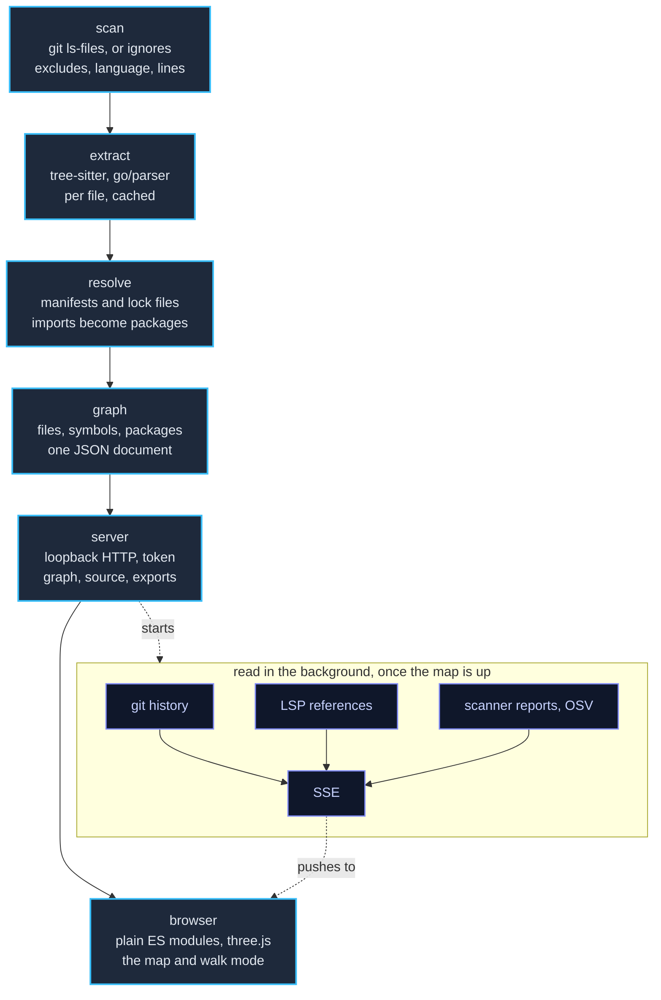

# depphunter

[](https://github.com/sarumaj/depphunter-cli/actions/workflows/ci.yml)

> **Note:** This codebase was developed with the assistance of AI tools
> (Claude, by Anthropic). All code is reviewed and tested before being merged.

|                   Initial view                    |                      Dependency trace                      |
|:-------------------------------------------------:|:----------------------------------------------------------:|
|  |       |
|                   **Walk mode**                   |                       **Night mode**                       |
|     |             |
|                  **Flight mode**                  |                 **Vulnerability hunting**                  |
|   |  |

Browse any code base as an interactive isometric archipelago in your browser.

- **Mainland** = your repository. Directories are terraces, files are buildings
  (height = lines of code, color = language). The map is drawn as a city:
  facades with windows, streets with sidewalks and crossings between buildings,
  ramps between levels, parks with trees, all in a rippling sea; when a
  selection dims the rest, dimmed buildings turn plain so the focus stands
  out.
- **Islands** = external ecosystems (Go modules, the standard library, …) with
  one building per dependency.
- **Click** anything to see what it depends on and what uses it: arcs over the
  map to each one, and the same edges laid down as roads through the streets,
  with chevrons for the direction the dependency runs in. A road to an external
  package leaves the shore as a causeway. **Double-click** to expand or collapse
  directories and files (files expand into their symbols).
- **Hunt** dependencies on foot (`V`): walk the map in first person on a tiny
  planet, `WASD` to move, the mouse to look, `Space` to jump, `F` to fly. You
  hold a tool - a fishing rod by default - drawn in your hands, on the end of an
  arm, and using it (click) on a building tags the module, lights up its
  dependency trails and plants a beacon over it. `T` takes out another: a
  butterfly net, a camera, a bubble wand, or the tracking dart. Each swings its
  own way and brings its own aim helper. Hold the right button for the scope,
  the mouse wheel zooms.
  Bugs walk the streets - one per finding a scanner reported - and catching one
  with any tool opens what was said about it; a tracker in the corner sweeps the
  map around you so you can see which way to walk to the next one.
  Terraces become city blocks: the space between buildings is a connected street
  network with sidewalks, lane markings and
  crossings, ramps and stairs lead between levels, empty lots are parks with
  trees and bushes, and bridges cross the water to every island.

The hands and forearms you see in walk mode are a rigged model, built by
`tools/hand.py` in Blender and exported to `web/static/hand.glb`; the script is
the source for it, so it can be read and regenerated rather than being a binary
nobody can change. They are also the only lit thing on the map - the walk camera
carries its own lights, and every other material is unlit, so the city keeps its
flat, data-first coloring.

The trees and bushes are the same arrangement: `tools/props.py` takes a CC0 low
poly nature pack, splits each model into its trunk and its crown so the map can
color and tint them apart, decimates it to something a few thousand instances
can afford, and writes `web/static/props.glb`. The beetle a finding walks the
streets as is modelled rather than fetched - neither pack has an insect in it -
by `tools/bug.py` into `web/static/bug.glb`: wing cases that take the severity's
color, a dark front end, and six legs that rock on their own.

Everything runs locally: one binary, no Node.js, and no network access unless
you ask for it with `--online` (see [Package indexes](#package-indexes)).

## Install

Download an archive for your platform from the
[releases](https://github.com/sarumaj/depphunter-cli/releases) (checksums in
`checksums.txt`), or build it with Go 1.27.1 or newer:

| OS      | Architectures                        | Archive   |
|---------|--------------------------------------|-----------|
| Linux   | amd64, arm64, armv7, 386, riscv64    | `.tar.gz` |
| macOS   | amd64 (Intel), arm64 (Apple silicon) | `.tar.gz` |
| Windows | amd64, arm64, 386                    | `.zip`    |
| FreeBSD | amd64, arm64                         | `.tar.gz` |

```sh
go install github.com/sarumaj/depphunter-cli/cmd/depphunter@latest
```

## Usage

```sh
depphunter            # analyze the current directory and open the browser
depphunter ~/src/app  # analyze another directory
depphunter --no-open --addr 127.0.0.1:8080
depphunter --watch    # keep the map in sync while you edit
depphunter --findings trivy.json      # put what a scanner reported on the map
depphunter --export dot -o deps.dot   # write the graph and exit
depphunter --export html -o map.html  # a self-contained map to share
```

| Flag                | Default                   |                                                                     |
|---------------------|---------------------------|---------------------------------------------------------------------|
| `--addr`            | `127.0.0.1:0`             | listen address; port 0 picks a free port                            |
| `--no-open`         |                           | print the URL instead of opening the browser                        |
| `--exclude`         |                           | glob of paths to skip (repeatable)                                  |
| `--max-file-size`   | `2097152`                 | larger files are listed but not read                                |
| `--config`          | `<path>/.depphunter.yaml` | config file to use                                                  |
| `--theme`           | `auto`                    | `auto`, `light`, `dark`                                             |
| `--color-by`        | `language`                | `language`, `size`, `commits`, `churn`, `age`, `authors`            |
| `--height-scale`    | `sqrt`                    | `linear`, `sqrt`, `log`                                             |
| `--style`           | `city`                    | what the map is dressed as: `city`, `circuit`, `galaxy`             |
| `--show-std`        | `false`                   | show standard-library islands                                       |
| `--expand-depth`    | `0`                       | initially expanded depth; `0` = auto, `-1` = all                    |
| `--watch`           | `false`                   | re-analyze on file changes, update the browser live                 |
| `--no-cache`        |                           | neither read nor write the analysis cache                           |
| `--no-history`      |                           | do not read git history                                             |
| `--history-commits` | `10000`                   | read at most this many commits                                      |
| `--resolve-depth`   | `0`                       | levels of dependencies-of-dependencies from lock files (`-1` = all) |
| `--online`          | `false`                   | ask package indexes for what the project's files do not record      |
| `--lsp`             |                           | find symbol references with installed language servers              |
| `--lsp-timeout`     | `5m`                      | time budget for language servers                                    |
| `--findings`        |                           | scanner report to place on the map (repeatable, globs)              |
| `--no-vulns`        |                           | place no findings, and do not ask the OSV database                  |
| `-v`, `--version`   |                           | print the version and exit                                          |
| `-h`, `--help`      |                           | list the flags with their defaults                                  |
| `--editor`          | auto-detected             | editor command template, e.g. `"code -g {file}:{line}"`             |
| `--embed`           |                           | origin allowed to show the map in a frame, e.g. `vscode-webview:` (repeatable) |
| `--export`          |                           | write `json`, `graphml`, `dot` or `html` and exit                   |
| `-o`, `--output`    | stdout                    | output file for `--export`                                          |

Long flags take two dashes (`--addr`, not `-addr`); a flag's value may follow
after a space or `=`.

Settings are resolved from, in increasing precedence: built-in defaults, the
user config (`$XDG_CONFIG_HOME/depphunter/config.yaml`, or the OS equivalent),
the project config `.depphunter.yaml`, `DEPPHUNTER_*` environment variables
(`ADDR`, `OPEN`, `EXCLUDE`, `MAX_FILE_SIZE`, `THEME`, `COLOR_BY`,
`HEIGHT_SCALE`, `SHOW_STD`, `EXPAND_DEPTH`, `WATCH`, `CACHE`, `EDITOR`,
`HISTORY`, `HISTORY_COMMITS`, `RESOLVE_DEPTH`, `ONLINE`, `LSP`, `LSP_TIMEOUT`),
and flags. Exclude globs
add up across all sources instead of replacing each other. The project config
cannot set `editor`: it arrives with the repository, and the editor is a command
depphunter runs.

```yaml
# .depphunter.yaml
exclude: [testdata, "*.pb.go"]
history_commits: 5000
ui:
  color_by: language
  height_scale: sqrt
  show_std: false
  expand_depth: 0
  tool: rod                       # walk mode: rod, net, camera, bubbles, dart
  hide_languages: [Markdown]      # filters, as the Filters panel sets them
  hide_islands: [npm]
  path_filter: "!**/testdata/**"
```

The browser's **Save settings** button writes the current color, height, theme,
depth and filters into the `ui:` section of `.depphunter.yaml` (or the
`--config` file), keeping the file's other keys and comments.

## Watch mode and cache

Parsing results are cached per file content under the user cache directory
(`~/.cache/depphunter` on Linux), so a second run only parses files that
changed: the CPython standard library goes from 1.2 s to 20 ms. With `--watch`,
depphunter watches the directories it analyzed, re-analyzes after changes settle
(300 ms), and pushes the new map to the browser, which keeps your expansion,
selection and filters and briefly highlights the files that changed.

## Exports

`--export` (or the **Export** menu in the browser) writes:

| Format    | Contents                                                                                                                                                                                                                                                                |
|-----------|-------------------------------------------------------------------------------------------------------------------------------------------------------------------------------------------------------------------------------------------------------------------------|
| `json`    | the full graph document the UI uses (nodes, symbols, edges)                                                                                                                                                                                                             |
| `graphml` | the full graph with all attributes, for Gephi, yEd or NetworkX                                                                                                                                                                                                          |
| `dot`     | the dependency graph for Graphviz: files, package directories and external packages, clustered per directory; standard-library packages and files without imports are left out                                                                                          |
| `html`    | the interactive map as one file that opens without depphunter or a network: UI, graph, source text (files up to 256 KB, 24 MB in total) and the view you are looking at — colors, height, theme, depth and filters (the CLI's `--export html` uses the configured view) |

**Export → PNG image** (or `P`) saves the map as shown, labels included, at your
screen's resolution; it also works in an exported HTML page.

The HTML export contains your source code and, when the git history was read,
commit authors' names; share it like you would share the repository.

Dependency graphs are shallow, so Graphviz draws them long and thin; for big
ones, `unflatten -l 3 -c 5 deps.dot | dot -Tsvg -o deps.svg` spreads them out.

## Git history

In a git work tree, depphunter reads the history of the analyzed files (the
newest 10,000 non-merge commits by default; `--history-commits` changes the
limit, `--no-history` turns it off) in the background once the map is shown, and
caches it per commit. The **color** menu then offers:

| Mode          | color shows                                                |
|---------------|------------------------------------------------------------|
| Commits       | commits per file (per-file mean for collapsed directories) |
| Lines changed | lines added plus deleted                                   |
| Last change   | how recently a file changed, recent is strong              |
| Authors       | distinct authors                                           |

Files without commits in range get a separate neutral color. The **Since**
slider in the legend limits commits, lines changed and authors to a time range;
tooltips and the side panel show the same figures, the panel also the top
authors. Renamed files keep the history of their old names. With `--watch`, a
new commit updates the overlay.

## CI pipelines

The code that runs with your repository's secrets is a dependency too, and it is
declared nowhere a package manager looks. depphunter reads it from the pipeline
files themselves - `.github/workflows/*.yml`, `action.yml`, `.gitlab-ci.yml`,
`*.gitlab-ci.yml` and `.gitlab/**` - and puts it on the map beside the packages:

- **GitHub Actions**: each step's `uses:`, reusable workflows (`jobs.<id>.uses`),
  and a composite action's own steps. A `./path` resolves to the `action.yml` or
  workflow inside this repository, so a local action's own dependencies chain on.
- **GitLab CI**: every `include:` form - `local`, `project` (with `ref` and
  `file`), `template`, `remote` and `component` - plus the includes a bridge job
  triggers.
- **Container images**: `container:`, `services:`, `docker://…` and a Docker
  action's `runs.image` on GitHub; `image:`, `services:` and `default:` on
  GitLab, per job and pipeline-wide.

Jobs become the symbols of their file, so a pipeline expands into its jobs the
way a source file expands into its functions.

Pinning is stricter here than in a package ecosystem, because a reference that
can be rewritten is not a pin: **only a commit or a digest counts**.
`actions/checkout@v4` floats - the tag can be moved to other code - and so does
`nginx:1.25.3`, since a tag is republished whenever its owner likes. The
hardening convention of pinning to a commit and naming the version in a comment
is read as both: `actions/setup-go@3041bf5… # v5.0.1` shows the commit as the
version and `v5.0.1` as what was requested. A GitLab template or a remote
include names no version at all and still changes under you, so it is floating
as well.

## Versions and pinning

Every external package carries the version the project resolves it to, and
whether anything fixes it there. Lock files, exact specifiers (`==1.2.3`,
`RequiredVersion`), single-version ranges (`[1.2.3]`), commits and digests pin a
dependency; ranges, wildcards, snapshots and moving tags let it drift. A
dependency nothing pins is drawn in amber, badged **⚠ floating** in the side
panel, and marked in its tooltip; where a lock file resolved a range, the panel
shows both - `4.3.1`, requested as `^4.2.0`.

| Ecosystem          | pinned by                                                            | floats on                                                   |
|--------------------|----------------------------------------------------------------------|-------------------------------------------------------------|
| Go modules         | the version in `go.mod`, which the build picks                       | a require without a version                                 |
| npm                | `package-lock.json`, `yarn.lock`, `pnpm-lock.yaml`, an exact `1.2.3` | any range - including `1.2`, which means 1.2.x              |
| crates.io          | `Cargo.lock`                                                         | the manifest alone: `"1.2.3"` there means `^1.2.3`          |
| PyPI               | `poetry.lock`, `uv.lock`, `pdm.lock`, `Pipfile.lock`, `==1.2.3`      | `>=`, `~=`, `^`, or no version at all                       |
| Maven              | a plain version, `[1.2.3]`                                           | ranges, `LATEST`, `RELEASE`, `-SNAPSHOT`, unexpanded `${…}` |
| NuGet              | an exact version, `[1.2.3]`                                          | wildcards (`2.*`) and ranges                                |
| PowerShell Gallery | `RequiredVersion`                                                    | `ModuleVersion`, which is a minimum                         |

The JSON and GraphML exports carry `requested` and `floating` per package.

## Dependencies of dependencies

`--resolve-depth` walks past what your code imports into what those packages
themselves pull in: `1` adds one level, `2` two, `-1` as far as the answer
reaches. The answer comes from the lock files the repository already carries -
nothing is fetched, and depphunter stays offline.

| Lock file                            | gives                                            |
|--------------------------------------|--------------------------------------------------|
| `package-lock.json` (v1-v3)          | every installed package and what it requires     |
| `pnpm-lock.yaml` (v5-v9)             | `packages:` and, since v9, `snapshots:`          |
| `yarn.lock` (classic)                | each entry's resolved version and `dependencies` |
| `Cargo.lock`                         | `dependencies` per crate                         |
| `uv.lock`, `poetry.lock`, `pdm.lock` | each distribution's own requirements             |

Packages that arrive this way are marked **transitive** - no file here imports
them - and the edges between packages are `depends`, apart from the `import`
edges that start at a file, so "imported by N files" keeps meaning what it says.
Two versions of one package are one building, as they always were, so an edge
between packages is an edge between names.

Ecosystems whose lock files carry no edges (`Pipfile.lock`) add nothing here;
those that keep the graph outside the repository (Go modules, and Maven, NuGet
and the PowerShell Gallery for now) need `--online`, below.

The side panel reads them as a **tree**: every row under *Depends on* and *Used
by* opens into what that node depends on in turn, and so on down. Nothing is
fetched - the edges are already in the map - so a row opens instantly, `▸`/`▾`
or the arrow keys open and close it, and what you opened stays open when a
`--watch` update redraws the panel. A package that depends on something that
depends back on it is shown once more with `↻` and left closed, because lock
files do contain cycles and a tree that followed one would never end.

## Package indexes

Every external package says where it comes from. depphunter reads the index
configuration your machine has and the one the repository carries - `.npmrc`
(including `@scope:registry`), `.yarnrc.yml`, `pip.conf` and a requirements
file's `--index-url`, Poetry and uv sources in `pyproject.toml`, `NuGet.config`,
a pom's `<repositories>`, `~/.m2/settings.xml` mirrors, `.cargo/config.toml`,
and `GOPROXY` - and the side panel names the index each package resolves from.
A container image needs no configuration: `ghcr.io/org/app` says it already.

The two are not treated alike. An index **your** machine names is trusted; one
that appears only in the repository is recorded and marked **⚠ index**, because
a repository that points your package manager at an index nobody here configured
is the shape a dependency-confusion attack takes. Nothing is ever fetched from
such an index.

`--online` lets depphunter ask the trusted indexes about dependencies the
repository does not record - which is how `--resolve-depth` reaches the
ecosystems whose graph lives outside the repo:

| Ecosystem | asked for                           | answer                           |
|-----------|-------------------------------------|----------------------------------|
| Go        | `<proxy>/<module>/@v/<version>.mod` | that module's own requires       |
| npm       | `<registry>/<package>/<version>`    | its `dependencies`               |
| PyPI      | `<host>/pypi/<name>/<version>/json` | `requires_dist`, extras excluded |

Lock files still come first: an index is asked only where the repository is
silent. Answers are cached for a day under the cache directory, credentials come
from your own `~/.npmrc` tokens and `~/.netrc` and are sent only to the host they
were written for, and Maven, NuGet and container registries are not asked yet.

## Findings

depphunter does not run a scanner; it reads what yours already wrote. Point
`--findings` at the JSON your CI produces (the flag is repeatable and takes
globs) and each report lands on the map:

| Tool                                  | written by                                         |
|---------------------------------------|----------------------------------------------------|
| `govulncheck -format json`            | the advisory, and the call site that reaches it    |
| `npm audit --json`                    | npm 7+ and the older npm 6 advisory table          |
| `trivy … --format json`               | vulnerabilities, misconfigurations and secret hits |
| `osv-scanner --format json`           | lock-file scans                                    |
| `golangci-lint run --out-format json` | one finding per issue                              |
| `eslint -f json`                      | one finding per message                            |

The format is recognized from the report's own shape, not from its file name,
so it does not matter what your pipeline calls them:

```sh
govulncheck -format json ./... > reports/govulncheck.json
trivy fs --format json -o reports/trivy.json .
depphunter --findings 'reports/*.json'
```

A finding is placed where it belongs: a vulnerability on the package it affects,
a linter's complaint on the file it is about, and a directory carries the worst
of everything below it. Severities are one scale - critical, high, medium, low,
info - taken from the advisory's CVSS v3 vector where there is one, because the
word a distribution chose often disagrees with it (Trivy's `MEDIUM` for
CVE-2020-8203 is a 9.8 vector). A linter's "error" is deliberately not a
critical advisory: lint findings are capped at medium, or the streets would fill
with bugs that mean a missing comment.

With `--online`, depphunter additionally asks [OSV](https://osv.dev) about every
external package the map pins to a version - one batched query for the whole
dependency tree, then the advisories it matched - for Go, npm, PyPI, crates.io,
Maven, NuGet and GitHub Actions. Floating packages are not asked: they resolve
to something else on the next install. Answers are cached for six hours.
`--no-vulns` turns all of it off.

Seen from above, every building that carries findings wears a **pin**, in the
color of the worst of them and standing taller the more there are: from across
the map the red ones are where to go next. Point at one for the tally, click it
to read them. The side panel lists them under **Findings**, worst first, each
opening in place for the description, the fixed version and the advisory link,
and a collapsed directory opens what is below it as well - a district is red for
something several levels down, and that is where it can be reached from.

In walk mode they come out on the streets: every finding is a **bug** patrolling
the building it belongs to, colored by severity, and catching one with whatever
tool is in your hands - the butterfly net was made for this - opens what it was
carrying. The HUD counts how many are left.

The **backpack** (`B`) is what the two views share. Taking a finding with the
`+` beside it in the panel is the same catch as netting its bug in the street -
the bug stops walking either way - and what is in there survives a relayout, a
depth change and a reload. It stays until the scanners stop reporting it, and is
then struck through rather than dropped, so seeing what you caught turn green is
the point of having caught it.

A repository is bigger than it looks from inside it, so the corner of the walk
HUD carries a **tracker**: a sweep centered on you and turning with you, with a
dot per bug in its severity's color, a ring per module you have already tagged,
and an arrow on the rim for anything beyond its range. Its range follows the
hunt - it fits whatever is still out there - and under it is how far the nearest
bug is and what it is carrying.

## Styles

The same map, dressed three ways (`--style`, or the **Style** menu):

| Style     | What it is                                                                                                                                                                                                                                                                                                                                                                                                        |
|-----------|-------------------------------------------------------------------------------------------------------------------------------------------------------------------------------------------------------------------------------------------------------------------------------------------------------------------------------------------------------------------------------------------------------------------|
| `city`    | Buildings with facades and roofs, streets with crossings and parks, shores with trees, bridges between the islands                                                                                                                                                                                                                                                                                                |
| `circuit` | A printed circuit board: chip packages with rows of pins, heatsinks where the buildings are tall, copper traces down every street with vias along them, solder pads and silkscreen around every part, capacitors where the trees were and LEDs, lit, where the lamps were. Off the edge of the board is the backplane it is plugged into, and it is live: charge runs along its tracks, which is this style's way of saying you cannot walk there |
| `galaxy`  | Platforms out in the dark: crystal spires with strata of light and windows like stars, glowing conduits between them, and instead of sea and sky the band of the galaxy with its dust lanes, two nebulae behind it and three layers of stars in front. The void the platforms hang in drifts, in layers and at three speeds, so the map view keeps drawing itself while this style is on; the other two are still |

Only the environment changes. The colors that carry data - the language
palette, the history overlays, hover and selection - are the same in all three,
so a style is a look and never a different reading of the code. Nothing else
changes either: the same layout, the same streets, the same walk.

## Symbol references

Imports show which files depend on which; with `--lsp`, depphunter also asks
language servers which symbols use which. It uses the servers it finds on `PATH`
(and `go install` locations for gopls):

| Language                | Server                                                     |
|-------------------------|------------------------------------------------------------|
| Go                      | `gopls`                                                    |
| JavaScript / TypeScript | `typescript-language-server`                               |
| Python                  | `pyright-langserver`, `basedpyright-langserver` or `pylsp` |
| Rust                    | `rust-analyzer`                                            |
| Java                    | `jdtls`                                                    |
| C#                      | `csharp-ls`                                                |

The servers run in the background after the map is shown (gopls needs about 7 s
for this repository), within `--lsp-timeout`; results are cached until the code
changes. The legend's **Imports / References** switch then changes what
selection arcs and the side panel show: for a function, what it uses and what
uses it. JSON and GraphML exports include the reference edges.

## Opening files in your editor

The side panel's **Open in editor** button (or `O`) opens the selected file at
the selected symbol's line. depphunter uses `--editor` / `DEPPHUNTER_EDITOR` /
the user config, or detects a GUI editor from `$VISUAL`, `$EDITOR` or `PATH` (VS
Code, Cursor, Zed, Sublime Text, JetBrains IDEs, …). Without one, the button
hands the file to VS Code's `vscode://` URL handler.

## In VS Code

`extension/` is a VS Code extension that puts the map in a tab beside the code.
It starts a server for the folder you are working in, waits for it to say where
it is listening, and opens that address in the editor's built-in browser; the
map behaves exactly as it does in a browser tab, live updates and all.

It is not on a marketplace yet. To build and install it:

```sh
cd extension
npm install
npx @vscode/vsce package     # depphunter-0.1.0.vsix
```

Then *Extensions: Install from VSIX…* in VS Code, and `depphunter: Open the Map`
from the command palette - or right-click a folder in the explorer. The
extension runs whatever `depphunter` it finds on `PATH`, so it carries no binary
of its own and the same `.vsix` works everywhere.

[extension/README.md](extension/README.md) has the settings, how the framing
works, what does not work over Codespaces, and what publishing it would take.

## Keyboard & mouse

Panning stops once the center of the view is a quarter of the map's size beyond
its edge, and zooming out once the map covers about a third of the view; in walk
mode you can go 3 units out over the water and 12 above the tallest building.

|                           |                                          |
|---------------------------|------------------------------------------|
| Drag / right-drag / wheel | pan / orbit / zoom                       |
| Click / double-click      | select / expand–collapse                 |
| `Enter`, `Backspace`      | expand–collapse selection, select parent |
| `→` `←` in the panel      | open / close a dependency row            |
| `Enter` while reading     | close the details and walk on            |
| `T` in walk mode          | take out another tool                    |
| `Q` `E`                   | rotate 90°                               |
| `F`                       | fit to screen                            |
| `+` `−`                   | expand / collapse one level everywhere   |
| `/`                       | search files, symbols and packages       |
| `O`                       | open the selected file in your editor    |
| `P`                       | save the map as a PNG image              |
| Legend click              | hide / show a language                   |
| Pin click                 | read the findings over a building        |
| `+` beside a finding      | put it in the backpack                   |
| `B`                       | the backpack: everything caught          |
| The figure                | where you were standing in walk mode     |
| `Esc`                     | close the backpack, or clear selection   |
| `V`                       | walk mode                                |

In walk mode:

|                        |                                                                                                             |
|------------------------|-------------------------------------------------------------------------------------------------------------|
| Mouse                  | look; captured at the reticle (`Esc` frees it, a click on the map captures it again), or drag               |
| `W` `A` `S` `D`/arrows | move / turn; `Shift` runs                                                                                   |
| `Space`                | jump (flying: straight up)                                                                                  |
| `F`                    | fly on / off; flying, `W`/`S` move where you look (look down and press `W` to dive), `C` goes straight down |
| Click                  | use what is in your hands: the module it reaches is tagged, a bug it catches is read out and kept           |
| `H`                    | put the tool away, or take it out again; it still works, and throws from your eye                           |
| Hold right button      | look through the scope                                                                                      |
| `Enter`                | details of what the reticle is on, like a second dart (frees the mouse; click the map to walk on)           |
| Wheel                  | zoom in / out                                                                                               |
| `+` `-` (or `[` `]`)   | planet size (curvature)                                                                                     |
| `V` / `Esc`            | back to the map; going in again puts you back where you stood                                               |

The map draws the walker where they are standing, as a figure facing the way
they were facing, and going back in puts them there - unless you picked
something on the map while you were away, which is how you say "take me there"
instead.

On foot, the shore stops you, but every island can be reached over a bridge;
flying, you can go 3 units out over the water. The ground you stand on is never
a target, so aiming at the street does not select it. Expanding and collapsing
is left to the map view: it rebuilds the whole city, which is disorienting from
street level. The key list folds away once you start moving; `?`
shows all controls.

## Security

The server binds to loopback by default and prints a URL containing a random
token, which the browser exchanges for a cookie. Requests without it, requests
with a foreign `Host` header (DNS rebinding), and requests for files that are
not part of the analyzed project are rejected. Nothing may put the map in a
frame: `X-Frame-Options: DENY` and `frame-ancestors 'none'`.

### Inside an editor

That last part is also what stops an editor showing the map in its own built-in
browser, which is a frame like any other. `--embed <origin>` allows the origins
it names, and only those - `--embed vscode-webview:` for VS Code - which is what
a wrapper such as an editor extension passes when it starts the server (see
[In VS Code](#in-vs-code)). Three things follow from it, and nothing else
changes:

- `frame-ancestors` names those origins instead of `'none'`, and
  `X-Frame-Options` is not sent, because it has no way to name an origin that
  browsers still honour.
- The token stays in the address instead of being exchanged for a cookie. A
  cookie set by the map is a third-party cookie inside somebody else's frame,
  and browsers do not send those back; the page reads the token from its own
  URL and returns it on every call, in a header, or in the query string for the
  event stream, which cannot set headers. `Referrer-Policy: no-referrer` keeps
  it out of any request that leaves.
- The interface's own files - `app.js` and what it imports - are served without
  the token, since a frame cannot attach one to a `<script src>`. They are the
  same bytes in every release and say nothing about the project. Everything
  under `/api`, and the document that hands the page its token, still needs it.

It is deliberately a flag and nothing else: no config file and no environment
variable can turn it on, so a repository cannot arrange to be framed by a page
of its choosing. Each origin is checked before it reaches the header, so nothing
passed on the command line can end the directive early or start another one.

## Languages

| Ecosystem               | Imports resolved through                                                                                                                                                          | Islands                                     |
|-------------------------|-----------------------------------------------------------------------------------------------------------------------------------------------------------------------------------|---------------------------------------------|
| Go                      | every `go.mod` (multi-module, local `replace`)                                                                                                                                    | Go modules, Go standard library             |
| JavaScript / TypeScript | relative paths, `tsconfig`/`jsconfig` `paths`, workspaces, `package.json` + `package-lock.json` / `yarn.lock` / `pnpm-lock.yaml`                                                  | npm, Node.js built-ins                      |
| Python                  | relative imports, `src/` layouts, requirements files, `setup.cfg`, literal `setup.py` lists, `pyproject.toml`, `Pipfile`, `poetry.lock`/`uv.lock`/`pdm.lock`/`Pipfile.lock`       | PyPI, Python standard library               |
| Rust                    | the module tree (`crate::`, `self::`, `super::`, `mod x;`), workspace and path crates, `Cargo.toml` (renamed and workspace dependencies) + `Cargo.lock`                           | crates.io, Rust standard library            |
| Java                    | source files by package path (any source root), `pom.xml` (properties, dependency management), Gradle scripts and version catalogs                                                | Maven, Java standard library                |
| C#                      | namespaces to project folders (`RootNamespace` + folder), `PackageReference`, `Directory.Packages.props`                                                                          | NuGet, .NET base library                    |
| PowerShell              | `using module`, `Import-Module`, dot-sourced and `&`-invoked scripts (`$PSScriptRoot`), `#Requires -Modules`, module manifests (`RequiredModules`, `RootModule`, `NestedModules`) | PowerShell Gallery, built-in modules        |
| CI pipelines            | GitHub workflows and composite actions (`uses:`, reusable workflows, `container:`, `services:`), GitLab pipelines (every `include:` form, components, `image:`, `services:`)      | GitHub Actions, GitLab CI, Container images |

Java imports name packages, not artifacts, so they are matched to Maven groupIds
by prefix, shared leading segments, artifact names and a short table of
well-known mismatches (Guava, JUnit 4, Lombok, …); what cannot be matched is
shown as unresolved.

Files in other languages appear on the map without dependency edges. Parsing
uses a pure-Go tree-sitter runtime (C# and PowerShell use small built-in
scanners instead), so the binary still cross-compiles without a C toolchain.

## How it works



1. **Scan** (`internal/scan`) lists the project's files through `git ls-files`
   (so `.gitignore` applies) or a built-in ignore list, applies `exclude`
   globs, and measures language (by extension) and lines of code.
2. **Extract** (`internal/lang/*`): every language plugin claims files and
   extracts imports and top-level symbols from the content alone. Files are
   parsed in parallel; results are cached by the SHA-256 of the content, the
   plugin version and the extension (`internal/cache`), so a second run only
   parses what changed.
3. **Resolve**: a per-run resolver of each plugin reads the manifests and
   lockfiles (`go.mod`, `package.json`, `pyproject.toml`, `Cargo.toml`,
   `pom.xml`, `*.csproj`, …) and turns every import into a local file or
   directory, a standard-library package or an external package with version.
4. **Graph** (`internal/analyze`, `internal/graph`): directories, files,
   symbols, ecosystems and packages become nodes, imports become edges; the
   document is what the UI, the exports and the cache exchange.
5. **Serve** (`internal/server`): a loopback HTTP server with a per-run token
   serves the embedded UI (`web/static`) and the graph (`/api/graph`), file
   source (`/api/file`), exports, "open in editor" and "save settings".
   Server-Sent Events (`/api/events`) push new graphs in `--watch` mode
   (`internal/watch`) and announce the git history (`internal/history`), the
   LSP references (`internal/lsp`) and what the scanners reported
   (`internal/findings`), all three read in the background once the map is up
   and re-read whenever a report is written.
6. **Render** (browser, plain ES modules, no build step): `model.js` builds a
   navigable tree with aggregates, `layout.js` computes the archipelago from
   the hierarchy and expansion state (never a force simulation, so the same
   repository always gives the same map), `scene.js` draws every box in one
   instanced three.js mesh and edges as arcs, `routes.js` finds the roads those
   edges take by one sweep over a grid of the map, `pins.js` and `bugs.js` put
   what the scanners reported over the buildings and on the streets,
   `labels.js` places labels, `filter.js` and `history.js` compute filters,
   search and history colors locally, and `walk.js`, `city.js` and `tools.js`
   add the first-person view and what it puts in your hands.

The HTML export (`--export html`) inlines the same modules as `data:` URLs with
the graph, settings, history and source text, so the page needs neither
depphunter nor a network.

### Built with

Go libraries (all pure Go, so every target cross-compiles with
`CGO_ENABLED=0`):

| Library                                                             | Used for                                                                |
|---------------------------------------------------------------------|-------------------------------------------------------------------------|
| [odvcencio/gotreesitter](https://github.com/odvcencio/gotreesitter) | tree-sitter runtime and grammars for JS/TS, Python, Rust and Java       |
| [golang.org/x/mod](https://pkg.go.dev/golang.org/x/mod)             | parsing `go.mod`                                                        |
| [BurntSushi/toml](https://github.com/BurntSushi/toml)               | `pyproject.toml`, `Cargo.toml`, Gradle version catalogs, TOML lockfiles |
| [gopkg.in/yaml.v3](https://pkg.go.dev/gopkg.in/yaml.v3)             | config files (comment-preserving save), `pnpm-lock.yaml`                |
| [tidwall/jsonc](https://github.com/tidwall/jsonc)                   | `tsconfig.json` / `jsconfig.json` with comments                         |
| [fsnotify/fsnotify](https://github.com/fsnotify/fsnotify)           | `--watch`                                                               |
| [sourcegraph/jsonrpc2](https://github.com/sourcegraph/jsonrpc2)     | talking to language servers (`--lsp`)                                   |
| [golang.org/x/sync](https://pkg.go.dev/golang.org/x/sync)           | bounded parallel scanning, parsing and LSP requests                     |
| [emicklei/dot](https://github.com/emicklei/dot)                     | DOT export                                                              |
| [kballard/go-shellquote](https://github.com/kballard/go-shellquote) | splitting editor command templates without a shell                      |
| [cli/browser](https://github.com/cli/browser)                       | opening the default browser                                             |
| [spf13/cobra](https://github.com/spf13/cobra)                       | the command line: flags, help, version                                  |
| [spf13/viper](https://github.com/spf13/viper)                       | layering defaults, config files, environment and flags                  |

Go itself provides `go/parser` for Go sources, `net/http` for the server and
`embed` for the UI. The browser UI vendors, in
[web/static/vendor](web/static/vendor/README.md):
[three.js](https://threejs.org) (WebGL rendering, orbit controls),
[highlight.js](https://highlightjs.org) (source highlighting),
[potpack](https://github.com/mapbox/potpack) (packing terraces) and
[fzf-for-js](https://github.com/ajitid/fzf-for-js) (fuzzy search). External
tools are optional: `git` for file listing and history, language servers for
`--lsp`.

## Development

```sh
go test -race ./...
go run honnef.co/go/tools/cmd/staticcheck@2026.2.1 ./...
```

CI (`.github/workflows/ci.yml`) builds and tests on Linux, macOS and Windows, on
the current Go and on exactly the Go that `go.mod` states, with
`GOTOOLCHAIN=local`, so a `go.mod` that claims less than the code needs fails
the build. It also checks formatting, `go mod
tidy`, vet, staticcheck, govulncheck, JavaScript syntax and Markdown, and
type-checks and packages the VS Code extension. Pushing a
`v*` tag runs `.github/workflows/release.yml`, which tests and then publishes
stripped binaries for every platform in the [Install](#install) table.

Both workflows build the archives with `scripts/dist.sh`, which also works
locally (it needs `zip`):

```sh
scripts/dist.sh v1.2.3                     # every target into dist/
TARGETS="linux/amd64 darwin/arm64" scripts/dist.sh
```

CI builds all targets on every push, keeps the archives for 14 days as workflow
artifacts, and runs the tests as 32-bit (`GOARCH=386`). Renovate
(`renovate.json`) opens grouped pull requests for non-major dependency updates;
one that needs a newer Go than `go.mod` states fails the oldest-Go job until
`go.mod` is raised with it.

The milestones and design decisions are in
[docs/REQUIREMENTS.md](docs/REQUIREMENTS.md).

## License

[BSD 3-Clause](LICENSE) © 2026 Dawid Ciepiela. The embedded three.js (MIT),
highlight.js (BSD 3-Clause), potpack (ISC) and fzf-for-js (BSD 3-Clause) keep
their own licenses; see
[web/static/vendor](web/static/vendor/README.md).
